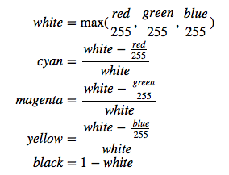
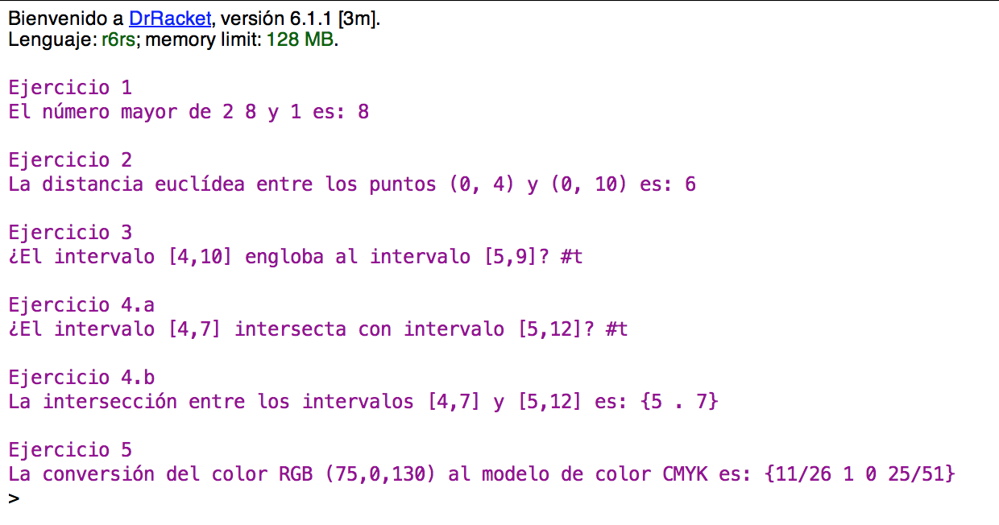

## Práctica 1: Introducción a Scheme

**Importante**: Antes de empezar esta práctica debes haber terminado
  *todos* los ejercicios del seminario de Scheme.

### Entrega de la práctica

Para entregar la práctica debes subir a Moodle el fichero
`practica01.rkt` con una cabecera inicial con tu nombre y apellidos, y
las soluciones de cada ejercicio separadas por comentarios. Cada
solución debe incluir:

- la **definición de las funciones** que resuelven el ejercicio
- una visualización por pantalla de uno de los ejemplos incluidos en
  el enunciado que **demuestre qué hace la función**, usando la
  función de `display`
- y un conjunto de **pruebas** que comprueben su funcionamiento.

Debes incluir casos de prueba **sustancialmente distintos** de los
ejemplos incluidos en el enunciado de cada ejercicio. Recuerda que
debes utilizar el API SchemeUnit.

Por ejemplo, supongamos que el primer ejercicio de la práctica 1 sea
implementar la función `suma-cuadrados` que vimos en la sesión de
introducción a Scheme y se proponen en el enunciado los siguientes
ejemplos:

```scheme
(suma-cuadrados 10 10) ;; ⇒ 200
(suma-cuadrados -2 9)  ;; ⇒  85
```

La solución se podría entregar de la siguiente forma:

**`practica01.rkt`**:

```scheme
;; José Fernandez Muñoz

#lang r6rs
(import (rnrs base)
        (rnrs io simple)
        (schemeunit))


;;
;; Ejercicio 1: suma-cuadrados
;;

(define (suma-cuadrados x y)
    (+ (* x x) (* y y)))

;; Demostración
(display "\n\nEjercicio 1\n")
(display "La suma de los cuadrados de 10 y 10 es: ")
(display (suma-cuadrados 10 10))

;; Pruebas
(check-equal?  (suma-cuadrados 10 10)  200)
(check-equal?  (suma-cuadrados -2 9)  85)
(check-equal?  (suma-cuadrados 5 -3)  34)
(check-equal?  (suma-cuadrados 0.5 9)  81.25)

;;
;; Ejercicio 2:
;;

...

```

En los casos de prueba incluimos los ejemplos del enunciado del
ejercicio, y fíjate que además hemos añadido dos casos de prueba
**sustancialmente distintos** de los ejemplos propuestos: en un caso
de prueba hemos utilizado un número negativo como segundo argumento de
la función y en otro caso de prueba utilizamos un número real como
argumento.

### Ejercicios


#### Ejercicio 1

Implementa la función `(mayor-de-tres n1 n2 n3)` que reciba tres
números como argumento y devuelva el mayor de los tres, intentando que
el número de condiciones sea mínima.

```scheme
(mayor-de-tres 2 8 1) ;; ⇒ 8
(mayor-de-tres 3 0 3) ;; ⇒ 3
```


#### Ejercicio 2

Implementa la función `(distancia-euclidea p1 p2)` que reciba dos
parejas como argumento que representan las coordenadas de dos puntos
2D y devuelva la distancia euclídea entre dichos puntos.

```scheme
(distancia-euclidea (cons 0 4) (cons 0 10)) ;; ⇒ 6
(distancia-euclidea (cons -2 5) (cons 9 7)) ;; ⇒ 11.180339887498949
```

**Nota:** Para testear correctamente funciones que devuelven números
reales necesitamos fijar la precisión con la que queremos comparar
el resultado esperado con el resultado devuelto por la función, de
forma que el test no falle si la diferencia entre ambos valores es
inferior a dicha precisión.

Los casos de prueba correspondientes a los ejemplos anteriores se
implementarían de la siguiente forma:

```
;; Fijamos el margen de error (precisión) para comparar números reales
(define precision 0.000001)

;; función auxiliar que compara números reales teniendo en cuenta una determinada precisión
(define (iguales-reales? x y)
  (< (abs (- x y)) precision))

(check-true (iguales-reales? (distancia-euclidea (cons 0 4) (cons 0 10)) 6.0))
(check-true (iguales-reales? (distancia-euclidea (cons -2 5) (cons 9 7)) 11.180339))
```

#### Ejercicio 3

Implementa la función `(engloba? a1 a2 b1 b2)` que recibe dos
intervalos de números enteros definidos por los valores de inicio y
fin de cada uno de ellos: `[a1, a2]` para el primer intervalo y
`[b1, b2]` para el segundo. La función debe comprobar si uno de los
intervalos **engloba al otro**.

No hay que comprobar errores, asumimos que siempre se van a realizar
llamadas correctas a la función en las que siempre se va a cumplir que
`a1 <= a2` y `b1 <= b2`.

```scheme
(engloba? 4 10 5 9) ;; ⇒ #t
(engloba? 4 9 4 15) ;; ⇒ #t
(engloba? 2 6 4 8) ;; ⇒ #f
```

Observa la siguiente representación gráfica de los ejemplos anteriores
para entender el resultado que devuelve la función en cada invocación:

```scheme
(engloba? 4 10 5 9)
  [------]
  4      10
   [----]
   5    9

(engloba? 4 9 4 15)
  [-----]
  4     9
  [-----------]
  4           15

(engloba? 2 6 4 8)
  [----]
  2    6
    [----]
    4    8
```


#### Ejercicio 4

a) Implementa la función `(intersectan? a1 a2 b1 b2)` que comprueba si
los intervalos `[a1, a2]` y `[b1, b2]` intersectan o no.

```scheme
(intersectan? 4 7 5 12)  ;; ⇒ #t
(intersectan? 4 9 12 15) ;; ⇒ #f
(intersectan? 2 5 5 8)   ;; ⇒ #t
```

Observa la siguiente representación gráfica de los ejemplos anteriores
para entender el resultado que devuelve la función en cada invocación:

```scheme
(intersectan? 4 7 5 12)
  [---]
  4   7
   [-------]
   5       12

(intersectan? 4 9 12 15)
  [-----]
  4     9
          [---]
          12  15

(intersectan? 2 5 5 8)
  [---]
  2   5
      [---]
      5   8
```

b) Implementa la función `(interseccion a1 a2 b1 b2)` que recibe dos
intervalos `[a1, a2]` y `[b1, b2]` y debe devolver una pareja con el
intervalo resultante de la intersección o la lista vacía en el caso en
que no intersecten.

Utiliza la función auxiliar definida en el apartado anterior.


```scheme
(interseccion 4 7 5 12)  ;; ⇒ {5 . 7}
(interseccion 4 9 12 15) ;; ⇒ ()
(interseccion 2 5 5 8)   ;; ⇒ {5 . 5}
```


#### Ejercicio 5

Existen muchos formatos para representar el color. El más conocido es
el RGB, que especifica el nivel de rojo (R), verde (G) y azul (B), en
una escala de 0 a 255. Otro formato conocido es el CMYK, que
especifica el nivel de cyan (C), magenta (M), amarillo (Y) y negro (K)
en una escala de 0.0 a 1.0. Implementa la función `(rgb->cmyk r g b)`
que toma los 3 valores RGB y devuelve una lista con los valores
convertidos a las cuatro componentes CMYK.

```scheme
(rgb->cmyk 75 0 130)    ;; ⇒ {11/26 1 0 25/51}
(rgb->cmyk 150 10 255)  ;; ⇒ {7/17 49/51 0 0}
(rgb->cmyk 255 255 255) ;; ⇒ {0 0 0 0}
(rgb->cmyk 0 0 0)       ;; ⇒ {0 0 0 1}
```

La forma de conversión es la siguiente: si los valores RGB son todos
0, entonces los CMY son todos 0 y el K (negro) es 1. En caso
contrario, se calcula de la siguiente forma:



Define las funciones auxiliares que consideres necesarias y después
utilízalas para definir la función principal.

**Nota:** En este último ejercicio, incluye sólo las pruebas de los
  ejemplos propuestos en el enunciado.


### Ejemplo de ejecución



----

Lenguajes y Paradigmas de Programación, curso 2015-16  
© Departamento Ciencia de la Computación e Inteligencia Artificial, Universidad de Alicante  
Cristina Pomares, Domingo Gallardo
