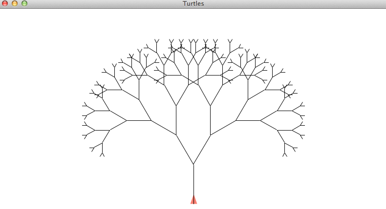
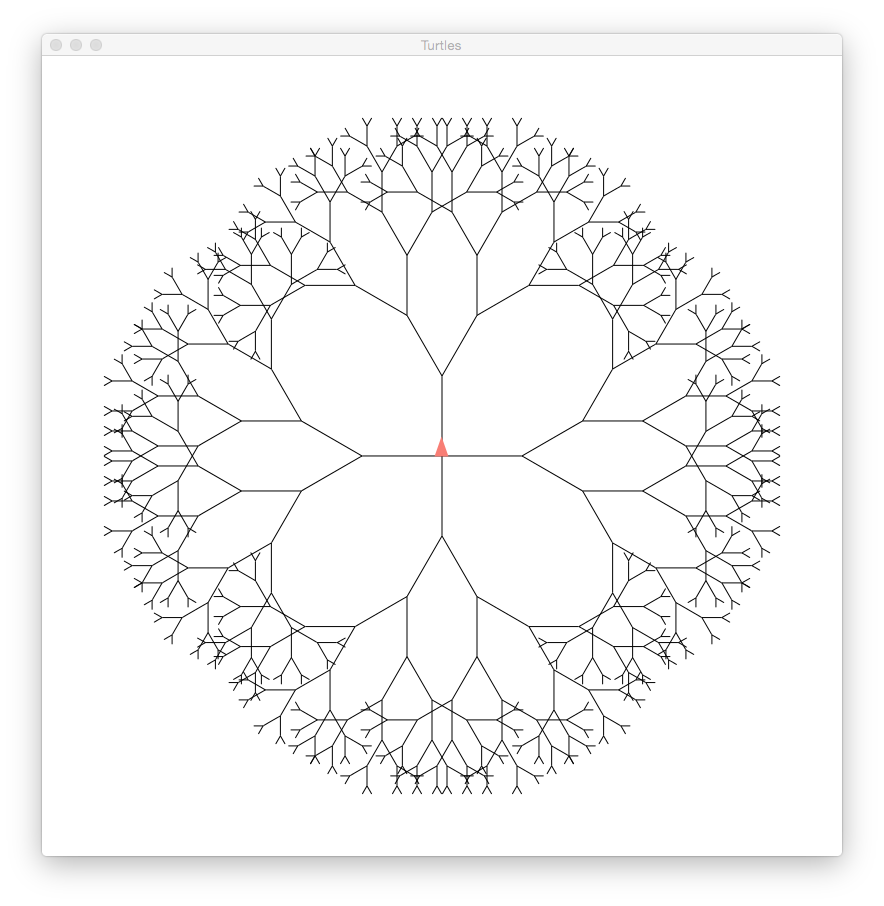

## Práctica 6: Procedimientos recursivos en gráficos de tortuga y listas estructuradas

### Entrega de la práctica

Para entregar la práctica debes subir a Moodle el fichero `practica06.rkt` con una cabecera inicial con tu nombre y apellidos, y las soluciones de cada ejercicio separadas por comentarios. Cada solución debe incluir:

- La **definición de las funciones** que resuelven el ejercicio.
- Una visualización por pantalla de uno de los ejemplos incluidos en el enunciado que **demuestre qué hace la función**, usando la función de `display`.
- Un conjunto de **pruebas** que comprueben su funcionamiento utilizando la librería `schemeunit`. Estas pruebas deben incluir los ejemplos proporcionados en los ejercicios y un mínimo de **2 casos de prueba sustancialmente distintos** a estos ejemplos.


**Notas**

- Para trabajar con listas estructuradas, utiliza la función `(hoja? lista)` vista en clase de teoría.
- Para utilizar los gráficos de tortuga incluye el `import` de la librería `(graphics turtles)`
- Los dos primeros ejercicios no requieren incluir pruebas propias


#### Ejercicio 1

a) Haciendo uso de los gráficos de tortuga, implementa una función `(arbol tam)` que dibuje recursivamente el árbol siguiente:

Ejemplo:
```scheme
(turtles #t) ; Inicializar tortuga
(turn 90)    ; Situar la tortuga mirando hacia arriba
(arbol 80)
```



Fíjate que un árbol está formado por dos subárboles más pequeños. El algoritmo es:

* Si `tam` es mayor que un umbral:
	- Dibujar la rama (una línea recta de determinado tamaño)
	- Girar la tortuga sobre sí misma un determinado número de grados a la izquierda, por ejemplo 30 para disponerte a dibujar el "subárbol" de la izquierda.
	- Dibujar un árbol un poco más pequeño que el tamaño actual
	- Girar la tortuga a la derecha para disponerte a dibujar el "subárbol" de la derecha (serán -60, ya que tienes que deshacer los 30 que giraste y girar otros 30 más)
	- Dibujar un árbol un poco más pequeño que el tamaño actual
	- Volver a girar a la izquierda 30 para quedarte mirando a la horizontal
	- Volver hacia atrás al punto de partida (en línea recta pero una cantidad negativa, usa la orden `move` en lugar de `draw` ya que no necesitas dibujar)

Ten en cuenta que la tortuga empieza mirando a la derecha, tendrás que girarla 90 grados a la izquierda antes de empezar a dibujar.

Prueba a variar la longitud de la rama o el número de grados, o a hacer árboles asimétricos en los que el número de grados que se gira para el subárbol izquierdo sea distinto al derecho.


b) Implementa una función `(arboles n giro tam)` que dibuje recursivamente `n` arboles de `tam` tamaño y en donde el siguiente árbol se dibuja después de un determinado `giro`:

Ejemplo:
```scheme
(clear)    ; Limpiamos la ventana de dibujo
(turn 90)
(arboles 4 90 80)
```




#### Ejercicio 2

a) Escribe la lista estructurada correspondiente a la siguiente representación gráfica por niveles, y escribe una única expresión que devuelva el elemento 'h

```text
       *
     / |  \
    *  d    *
   / \   / /  | \
  a  b  c *   *  h
          |  / \
          e f  g
```

```scheme
(define lista-a '(________))

(________)   ⇒  'h
```


b) Escribe la lista estructurada correspondiente a la siguiente representación gráfica por niveles, y escribe una única expresión que devuelva el elemento 10

```text
      *
  /  /  \  \
 1  *   *   8  
  / | \   \  
6   *  10  2
    |    
    3   
```

```scheme
(define lista-b '(________))

(________)   ⇒  10
```


#### Ejercicio 3

a.1) Implementa la función recursiva `(suma-lista lista)` que calcula la suma de todos los elementos de la lista estructurada que le pasamos como parámetro. Suponemos que son listas formadas por números.

```scheme
(suma-lista '(1 (2 (3 ((((4)))) 5) 6 7))) ⇒ 28
```

a.2) Implementa la versión FOS de la función anterior.

b.1) Implementa la función recursiva `(aplana lista)` que tome una lista estructurada como parámetro y devuelva una lista que contenga sus elementos.


Ejemplo:

```scheme
(aplana '(1 (2 (3) 4 (5 (6 (7) 8)))))
⇒ {1 2 3 4 5 6 7 8}
```

b.2) Implementa la versión FOS de la función anterior.


#### Ejercicio 4


a) Implementa la función recursiva `(diff-listas l1 l2)` que tome como argumentos dos listas estructuradas con la misma estructura, pero con diferentes elementos, y devuelva una lista de parejas que contenga los elementos que son diferentes.

Ejemplos:

```scheme
(diff-listas '(a (b ((c)) d e) f) '(1 (b ((2)) 3 4) f))
⇒ {{a . 1} {c . 2} {d . 3} {e . 4}}

(diff-listas '((a b) c) '((a b) c))
⇒ ()
```

b) Implementa la función recursiva `(sustituye-elem lista elem-old elem-new)` que recibe
como argumentos una lista estructurada y dos elementos, y devuelve otra lista con la misma
estructura, pero en la que se ha sustituido las ocurrencias de elem-old por elem-new

Ejemplo:

```scheme
(sustituye-elem  '(a b (c d (e c)) c (f (c) g))  'c  'h)
⇒ {a b {h d {e h}} h {f {h} g}}
```


#### Ejercicio 5

Implementa la función recursiva `(transformar lista plantilla)` que reciba dos listas como argumento: la primera lista será una lista estructurada y estará compuesta por números enteros positivos con una estructura jerárquica, como `(2 (3 1) 0 (4))`. La segunda lista será una lista plana con tantos elementos como indica el mayor número de plantilla más uno (en el caso anterior serían 5 elementos). La función deberá devolver una lista estructurada en la que se hayan sustituido los números de la primera lista por los elementos de la plantilla situados en la posición indicada por cada número. Puedes hacer uso de la función predefinida `list-ref`.

Ejemplos:

```scheme
(transformar '((0 1) 4 (2 3)) '(hola que tal estas hoy))
⇒ {{hola que} hoy {tal estas}}
(transformar '(1 4 3 2 6 5 (0)) '(lambda es una forma especial de Scheme))
⇒ {es especial forma una Scheme de {lambda}}
```


----

Lenguajes y Paradigmas de Programación, curso 2015-16  
© Departamento Ciencia de la Computación e Inteligencia Artificial, Universidad de Alicante  
Antonio Botía, Cristina Pomares, Domingo Gallardo  
