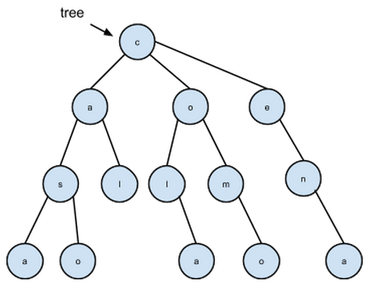
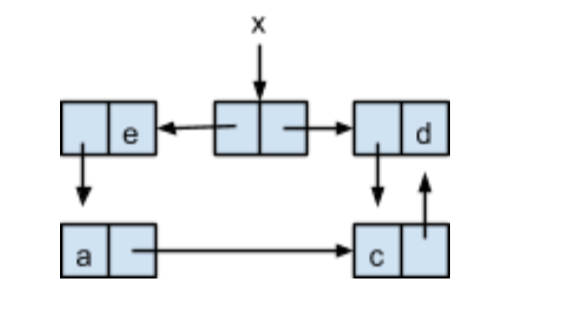
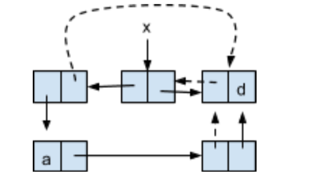

## Práctica 7: Árboles y programación imperativa

### Entrega de la práctica

Para entregar la práctica debes subir a Moodle el fichero
`practica07.rkt` con una cabecera inicial con tu nombre y apellidos, y
las soluciones de cada ejercicio separadas por comentarios. Cada
solución debe incluir:

- La **definición de las funciones** que resuelven el ejercicio.
- Una visualización por pantalla de uno de los ejemplos incluidos en
  el enunciado que **demuestre qué hace la función**, usando la
  función de `display`.
- Un conjunto de **pruebas** que comprueben su funcionamiento
  utilizando la librería `schemeunit`. Estas pruebas deben incluir los
  ejemplos proporcionados en los ejercicios y un mínimo de **2 casos
  de prueba sustancialmente distintos** a estos ejemplos.


**Notas**

- Para trabajar con árboles, utiliza la barrera de abstracción vista
  en clase de teoría.
- Para trabajar con las formas especiales mutadoras incluye el
  `import` de la librería `(rnrs mutable-pairs)`.
- El ejercicio 4 no requiere incluir pruebas propias.

#### Ejercicio 1

Implementa dos versiones de la función `(to-string-tree tree)` que
recibe un árbol de símbolos y devuelve la cadena resultante de
concatenar todos los símbolos en recorrido preorden. Una versión con
recursión mutua sin FOS y otra con una única función en la que se use
FOS.

```scheme
(define tree '(a (b (c (d)) (e)) (f)))
(to-string-tree tree) ⇒ "abcdef"
```


#### Ejercicio 2

a) Decimos que un árbol está ordenado cuando cumple las siguientes
propiedades:

- El dato de la raíz es mayor los datos de las raíces de sus hijos
- Los datos de los las raíces de sus hijos están en orden creciente
- Todos los hijos son árboles que están ordenados

Implementa la función `(ordenado-tree? tree)` que compruebe si un
árbol cumple las condiciones anteriores. Puedes usar FOS, recursión
mutua y/o funciones auxiliares.

Ejemplos:

```scheme
(ordenado-tree? '(10 (5) (7))) ⇒ #t
(ordenado-tree? '(50 (10 (4) (6) (8)) (25 (15)))) ⇒ #t
(ordenado-tree? '(10 (8) (7))) ⇒ #f
(ordenado-tree? '(6 (5) (7))) ⇒ #f
(ordenado-tree? '(50 (10 (4) (6) (11)) (25) (15))) ⇒ #f
```

b) Implementa la función `(calcula-tree tree)` que reciba como
argumento un árbol que representa una expresión aritmética (con los
símbolos `+`, `-`, `*` y `/` en los nodos y números en las hojas) y
devuelva su resultado. Puedes usar FOS, recursión mutua y/o funciones
auxiliares. Suponemos que todos los subárboles del árbol que se recibe
tienen dos hijos (excepto los subárboles hoja)

Ejemplo:

```scheme
(calcula-tree '(+ (- (5) (2)) (3))) ⇒ 6
(calcula-tree '(* (- (2) (+ (3) (* (4) (- (6) (2))))) (1))) ⇒ -17
```

Puedes ayudarte del siguiente procedimiento:

```scheme
(define (operator op)
    (cond
        ((equal? op '+) +)
        ((equal? op '-) -)
        ((equal? op '*) *)
        ((equal? op '/) /)
        (else (error "Operador desconocido: " op))))
```

#### Ejercicio 3

a) Implementa la función `(nivel-dato-tree tree dato)` que recorra el
árbol y devuelve el nivel en que se encuentra el dato. Si el dato está
en la raíz debe devolver 1 y si no está debe devolver 0. Puedes usar
FOS, recursión mutua y/o funciones auxiliares. Puede ser una función
con recursión pura o con recursión por la cola.

Ejemplos:

```scheme
(nivel-dato-tree '(20 (18) (19 (30) (32)) (4)) 30) ⇒ 3
(nivel-dato-tree '(a (b) (c (d) (e)) (f)) 'g) ⇒ 0
```

b) Implementa la función `(palabras-tree tree)` que reciba un árbol de
símbolos y devuelva una lista con todas las palabras obtenidas como
resultado de recorrer cada una de sus ramas. Puedes usar FOS,
recursión mutua y/o funciones auxiliares.

Ejemplos:



```scheme
(palabras-tree tree) ⇒ {"casa" "caso" "cal" "cola" "como" "cena"}
```

----

### Tema 4: Programación imperativa

#### Ejercicio 4

a) Escribe las instrucciones necesarias que generan el siguiente box &
pointer:



b) Escribe las instrucciones necesarias que realizan los siguientes
cambios (utilizando como única referencia la x)




#### Ejercicio 5

a) Implementa la función `(rellena-lista! lista dato)` que modifica la
lista que le pasamos como parámetro sustituyendo todos sus elementos
por el dato.

Ejemplos:

```scheme
(define lista '(1 2 3 4))
(rellena-lista! lista 'a)
lista  ⇒ {a a a a}
```

b) Implementa la función `(intercambia-listas! lista1 lista2)` que
intercambia los elementos de ambas listas hasta el tamaño de la lista
menor.

Ejemplos:

```scheme
(define lista1 '(1 2 3 4 5))
(define lista2 '(a b c))
(intercambia-listas! lista1 lista2)
lista1  ⇒ {a b c 4 5}
lista2  ⇒ {1 2 3}
```

----

Lenguajes y Paradigmas de Programación, curso 2015-16  
© Departamento Ciencia de la Computación e Inteligencia Artificial, Universidad de Alicante  
Antonio Botía, Cristina Pomares, Domingo Gallardo  
