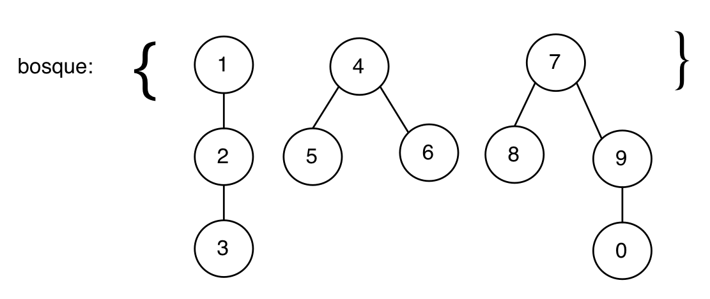
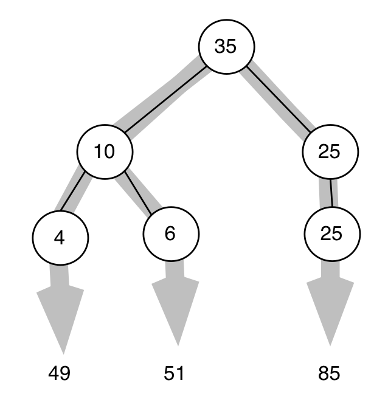
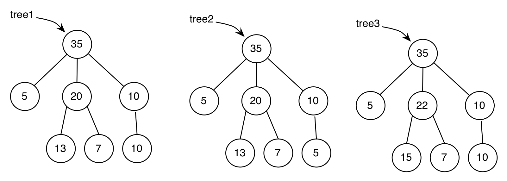

## Práctica 7: Árboles

### Entrega de la práctica

Para entregar la práctica debes subir a Moodle el fichero
`practica07.rkt` con una cabecera inicial con tu nombre y apellidos, y
las soluciones de cada ejercicio separadas por comentarios. Cada
solución debe incluir:

- La **definición de las funciones** que resuelven el ejercicio.
- Un conjunto de **pruebas** que comprueben su funcionamiento
  utilizando la librería `schemeunit`.

## Ejercicios


### Ejercicio 1 ###

a.1) Escribe la sentencia en Scheme que define el siguiente árbol
genérico y escribe **utilizando las funciones de la barrera de
abstracción de árboles** una expresión que devuelva el número 10.


```
(define arbol '(_________))
(check-equal? __________ 10)
```


a.2) Escribe la sentencia en Scheme que define el siguiente árbol
binario y escribe **utilizando las funciones de la barrera de
abstracción de árboles binarios** una expresión que devuelva el número 29.


```
(define arbolb '(_________))
(check-equal? __________ 29)
```


b.1) Las funciones que suman los datos de un árbol utilizando
recursión mutua y que hemos visto en teoría son las siguientes:

```scheme
(define (suma-datos-arbol arbol)
    (+ (dato-arbol arbol)
       (suma-datos-bosque (hijos-arbol arbol))))

(define (suma-datos-bosque bosque)
    (if (null? bosque)
        0
        (+ (suma-datos-arbol (car bosque)) 
           (suma-datos-bosque (cdr bosque)))))
```


Si realizamos la siguiente llamada a la función `suma-datos-bosque`,
siendo `arbol` el definido anteriormente:

```scheme
(suma-datos-bosque (hijos-arbol arbol))
```

1. ¿Qué devuelve la invocación a `(suma-datos-arbol (car bosque))` que
  se realiza dentro de la función?
2. ¿Qué devuelve la primera llamada recursiva a `suma-datos-bosque`?

Escribe la contestación a estas preguntas como comentarios en el
fichero de la práctica.

b.2) La función de orden superior que hemos visto en teoría y que
realiza también la suma de los datos de un árbol es:

```scheme
(define (suma-datos-arbol-fos arbol)
   (fold-right + (dato-arbol arbol) 
       (map suma-datos-arbol-fos (hijos-arbol arbol))))
```	

Si realizamos la siguiente llamada a la función, siendo `arbol` el
definido anteriormente:

```scheme
(suma-datos-arbol-fos arbol)
```

1. ¿Qué devuelve la invocación a `map` dentro de la función?
2. ¿Cuáles son las invocaciones a la función `+` que se realizan
   durante la ejecución de `fold-right`? Enumera en orden esas
   invocaciones, indicando sus parámetros y el valor devuelto en cada
   una de ellas.

### Ejercicio 2 ###

Implementa dos versiones de la función `(to-string-arbol arbol)` que
recibe un árbol de símbolos y devuelve la cadena resultante de
concatenar todos los símbolos en recorrido preorden. 

Una versión con recursión mutua y otra (llamada `to-string-arbol-fos`)
con una única función en la que se use funciones de orden superior.


```scheme
(define arbol '(a (b (c (d)) (e)) (f)))
(to-string-arbol arbol) ⇒ "abcdef"
```


<!--

a) Utilizando recursión mutua, define la función `(cuenta-pred-tree
pred tree)` que recibe un árbol y un predicado y cuenta todos los nodos
que cumplan el predicado.

```scheme
(cuenta-pred-tree even? '(1 (2) (3 (4) (5 (6))) (7))) ; ⇒ 3
```

b) Define la función anterior usando funciones de orden superior.


### Ejercicio 2

Define la función `(nivel-bosque nivel bosque)` que recibe dos
argumentos: una lista de árboles y un número indicando un nivel. La
función debe devolver una lista con los nodos del nivel indicado de
todos los árboles. Puedes usar funciones de orden superior y/o
recursión mutua.

Ejemplo:



```scheme
(define bosque '((1 (2 (3))) (4 (5) (6)) (7 (8) (9 (0)))))
(nivel-bosque 1 bosque) ; ⇒ '(2 5 6 8 9)
```

### Ejercicio 3

Implementa la función `(suma-ramas-tree tree)` que reciba un árbol de
números y devuelva una lista con cada una de las sumas de todas sus
ramas. Puedes usar funciones de orden superior y/o recursión mutua.

Ejemplo:



```scheme
(suma-ramas-tree '(35 (10 (4) (6)) (25 (25)))) ; ⇒ '(49 51 85)
(suma-ramas-tree '(50 (10 (4) (6)) (25 (25)))) ; ⇒ '(64 66 100)
```

### Ejercicio 4

Escribe el predicado `(suma-hijos-tree? tree)` que recibe un árbol de
números enteros y recorre el árbol devolviendo `#t` en caso de que para
todos sus nodos (excepto los nodos hoja) se cumpla que la suma de las
raíces de los hijos coincida con el dato del nodo. Puedes usar
funciones de orden superior y/o recursión mutua.

Ejemplos:



```scheme
(suma­-hijos-­tree? tree1) ; ⇒  #t
(suma-­hijos-­tree? tree2) ; ⇒  #f
(suma-hijos-tree? tree3) ; ⇒  #f
```

### Ejercicio 5

a) Implementa la función `(calcula-tree tree)` que reciba como
argumento un árbol que representa una expresión aritmética (con los
símbolos `+`, `-`, `*` y `/` en los nodos y números en las hojas) y
devuelva su resultado. Puedes usar funciones de orden superior,
recursión mutua y/o funciones auxiliares.  Suponemos que todos los
subárboles del árbol que se recibe tienen dos hijos (excepto los
subárboles hoja).

Puedes ayudarte del siguiente procedimiento:

```swift
(define (operador op)
    (cond
        ((equal? op '+) +)
        ((equal? op '-) -)
        ((equal? op '*) *)
        ((equal? op '/) /)))
```

Ejemplos:

```scheme
(calcula-tree '(- (+ (5) (2)) (3))) ; ⇒ 4
(calcula-tree '(* (- (2) (+ (3) (* (4) (/ (6) (2))))) (2))) ; ⇒ -26
```

b) Implementa la función `(calcula-tree-op-conmutativo tree)` que
reciba como argumento un árbol que al igual que en el apartado
anterior, representa una expresión aritmética, y debe devolver el
resultado de su evaluación. A diferencia del apartado anterior, el
árbol que se recibe solo contiene los operadores conmutativos `+` y
`*`, y el número de hijos de los subárboles puede ser mayor de 2.

Ejemplos:

```swift
(calcula-tree-op-conmutativo '(+ (* (5) (2) (6)) (3))) ; ⇒ 63
(calcula-tree-op-conmutativo '(* (+ (2) (* (3) (+ (4) (* (3) (2) (2))))) (2))) ; ⇒ 100
```

-->


----

Lenguajes y Paradigmas de Programación, curso 2017-18  
© Departamento Ciencia de la Computación e Inteligencia Artificial, Universidad de Alicante  
Domingo Gallardo, Cristina Pomares, Antonio Botía, Francisco Martínez
