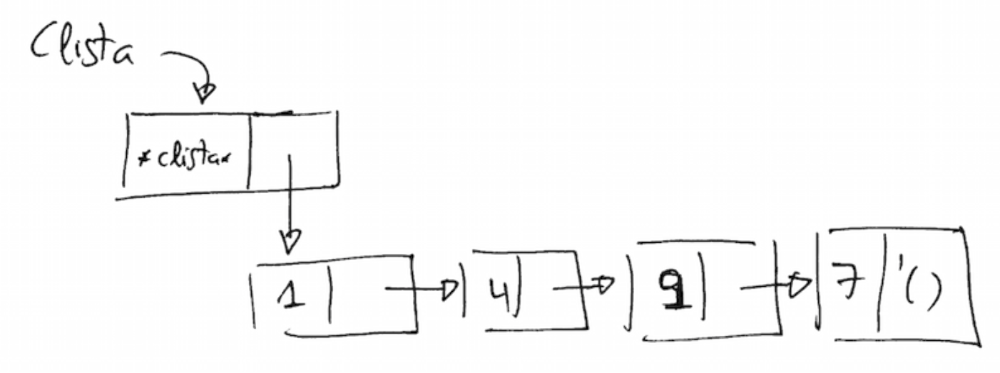
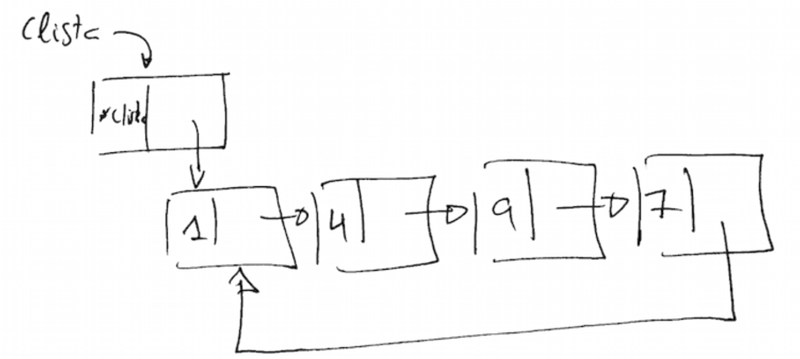

## Práctica 8: Programación imperativa

### Entrega de la práctica

Para entregar la práctica debes subir a Moodle el fichero
`practica08.rkt` con una cabecera inicial con tu nombre y apellidos, y
las soluciones de cada ejercicio separadas por comentarios. Cada
solución debe incluir:

- La **definición de las funciones** que resuelven el ejercicio.
- Una visualización por pantalla de uno de los ejemplos incluidos en
  el enunciado que **demuestre qué hace la función**, usando la
  función de `display`.
- Un conjunto de **pruebas** que comprueben su funcionamiento
  utilizando la librería `schemeunit`. Estas pruebas deben incluir los
  ejemplos proporcionados en los ejercicios y un mínimo de **2 casos
  de prueba sustancialmente distintos** a estos ejemplos.

#### Notas

- En las funciones en las que hay que trabajar con mutación es
  importante dibujar los diagramas _box_and_pointer_ de las
  estructuras y pensar la solución sobre estos dibujos.

- En el ejercicio 1 no hace falta hacer pruebas con `check`.

#### Ejercicio 1

Implementa el procedimiento mutador `(crear-lista-circular! clista)`
que reciba una lista con cabecera y devuelva la correspondiente lista
circular: el siguiente al último elemento será el primer elemento

Ejemplo:

```swift
(define clista '(*clista* 1 4 9 7))
```




```swift
(crear-lista-circular! clista)
clista ⇒ {*clista* . #0={1 4 9 7 . #0#}}
```



#### Ejercicio 2

Implementa el procedimiento mutador `(intercambia-elementos! lista)`
que reciba una lista con cabecera con un número par de elementos e
intercambie sus elementos de dos en dos. Debes proponer una solución
que no utilice `set-car!`

Ejemplos:

```scheme
(define lista '(*clist* 1 2 3 4))
(intercambia-elementos! lista)
lista ⇒ (*clist* 2 1 4 3)
```


#### Ejercicio 3

Define el tipo de dato mutable _Pila_ que implementa una
[pila](https://en.wikipedia.org/wiki/Stack_(abstract_data_type)) en la
que se añaden y se sacan elementos con mutación. La barrera de
abstracción se define por las siguientes funciones:

- `(make-pila)`: construye una pila vacía y la devuelve
- `(push-pila! pila dato)`: añade un dato en la pila
- `(pop-pila! pila)`: devuelve el último dato añadido en la pila y
  desapila la pila. No devuelve nada si la pila está vacía.
- `(vacia-pila? pila)`: #t si la pila está vacía

Ejemplo:

```scheme
(define pila1 (make-pila))
(push-pila! pila1 10)
(push-pila! pila1 "hola")
(push-pila! pila1 'a)
(pop-pila! pila1) ⇒ 'a
(pop-pila! pila1) ⇒ "hola"
(pop-pila! pila1) ⇒ 10
(vacia-pila? pila1) ⇒ #t
(pop-pila! pila1)
```

#### Ejercicio 4

Modifica el tipo de dato mutable _Diccionario_ visto en el
[tema de teoría](http://domingogallardo.github.io/lpp/teoria/Tema04-ProgramacionImperativa.html#3-4)
para que se guarde la información de cuántas veces se ha cambiado el
valor asociado a cada clave. El primer `put` de una clave se considera
un cambio (se guarda 1) y cada nuevo `put` debe incrementar en 1 el
número de cambios.

Se debe definir también la función `(cambios-dic diccionario clave)`
que devuelve el número de cambios que ha tenido una clave. En el caso
en que la clave no exista en el diccionario se devolverá 0.

Ejemplo:


```scheme
(define dic (make-dic))
(put-dic! dic 'a 20) ⇒ ok
(cambios-dic dic 'a) ⇒ 1
(put-dic! dic 'a 30) ⇒ ok
(cambios-dic dic 'a) ⇒ 2
(get-dic dic 'a) ⇒ 30
(cambios-dic dic 'b) ⇒ 0
(put-dic! dic 'b 10)
(cambios-dic dic 'b) ⇒ 1
```

#### Ejercicio 5

Implementa la función `(memorizador func)` que recibe una función de
un argumento y devuelve una clausura que se comporta como la función
original, pero que guarda los resultados que se van generando en una
pila local (usa la pila implementada en el ejercicio anterior). Cuando
recibe como parámetro el símbolo `'mem` devuelve el último resultado
apilado y lo desapila.

Ejemplo:

```swift
(define (cuadrado x)
   (* x x))
(define f (memorizador cuadrado))

(f 10) ⇒ 100
(f 3) ⇒ 9
(f 2) ⇒ 4
(f 'mem) ⇒ 4
(f 'mem) ⇒ 9
(f 6) ⇒ 36
(f 'mem) ⇒ 36
(f 'mem) ⇒ 100
(f 'mem)
```


----

Lenguajes y Paradigmas de Programación, curso 2015-16  
© Departamento Ciencia de la Computación e Inteligencia Artificial, Universidad de Alicante  
Antonio Botía, Domingo Gallardo, Cristina Pomares  


