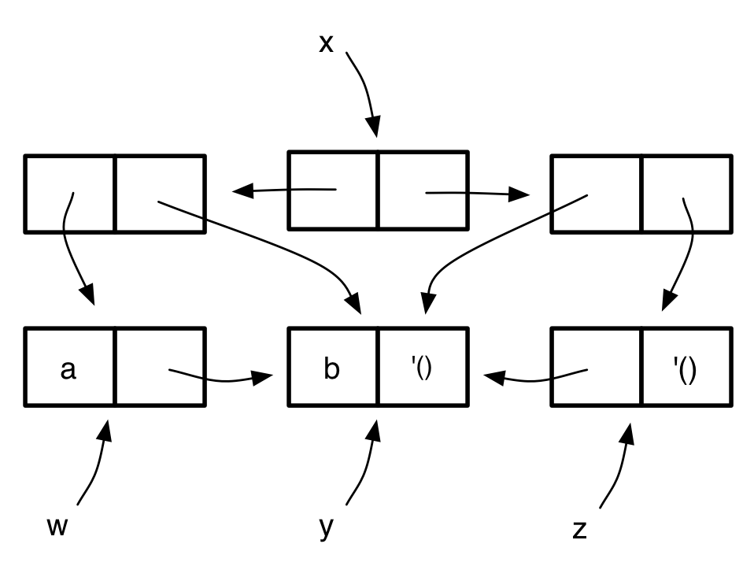

## Práctica 8: Estructuras de datos mutables

### Entrega de la práctica

Para entregar la práctica debes subir a Moodle el fichero
`practica08.rkt` con una cabecera inicial con tu nombre y apellidos, y
las soluciones de cada ejercicio separadas por comentarios. Cada
solución debe incluir:

- La **definición de las funciones** que resuelven el ejercicio.
- Un conjunto de **pruebas** que comprueben su funcionamiento
  utilizando la librería `schemeunit`.

## Ejercicios

### Ejercicio 1

a) Dado el siguiente diagrama _box-and-pointer_:




1. Escribe las instrucciones de Scheme que lo generan. Sólo puedes
   usar las variables auxiliares mostradas en el diagrama.
2. Dibuja el diagrama resultante después de evaluar la expresión:

```scheme
(set-car! (cddr x) (caar x))
```

b) Dadas las siguientes instrucciones, ¿qué imprimirá DrRacket en las
distintas evaluaciones de la variable lista?.  Evidentemente, debes
hacer el ejercicio **sin utilizar el intérprete**. Dibuja el diagrama
_box-and-pointer_, comprueba cómo se modifica con las sentencias
mutadoras y estudia la estructura del diagrama resultante.

```scheme
(define lista (list (cons 'a 'b) (cons 'c 'd) 'e))
(set-cdr! (car lista) '())
(set-cdr! (cadr lista) (cddr lista))
lista ; ⇒ ???
(set-car! (cddr lista) 'f)
lista ; ⇒ ???
(set-car! (cadr lista) (caar lista))
lista ; ⇒ ???
(set-cdr! (car lista) (cons 'g (cadr lista)))
lista ; ⇒ ???
```

### Ejercicio 2

Define la función mutadora `(filtra-olist! pred olist)` que recibe una
lista ordenada con cabecera y un predicado, y elimina con mutación los
elementos de la lista que no cumplan el predicado. La solución no debe
crear nuevas parejas ni usar `set-car!`.

```scheme
(define lista (list '*olist* 10 15 20 25 30 35 40 45))
(filtra-olist! odd? lista)
lista ; ⇒ {*olist* 15 25 35 45}
```

### Ejercicio 3

a) Implementa la versión mutadora de `append` para listas con cabecera. Define para ello
el procedimiento mutador `(append-clist! clista1 clista2)`.

Ejemplo:

```scheme
(define clista1 '(*clist* 1 2 3))
(define clista2 '(*clist* 8 7 6))
(append-clist! clista1 clista2)
clista1 ; ⇒ {*clist* 1 2 3 8 7 6}
```

b) Implementa el  procedimiento mutador `(fusiona-olist! olista1 olista2)` que recibe dos listas
ordenadas con cabecera, y muta `olista1` para que incluya los elementos de `olista2`, manteniendo el
orden de sus elementos.

**Importante**: debes implementar una solución en la que solo se recorra una vez cada una de las listas
y sin crear nuevas parejas. Además suponemos que los elementos de ambas listas son distintos.

Ejemplo:

```scheme
(define olista1 '(*olist* 2 3 5 8))
(define olista2 '(*olist* 1 4 6 7 9))
(fusiona-olist! olista1 olista2)
olista1 ; ⇒ {*olist* 1 2 3 4 5 6 7 8 9}
```

### Ejercicio 4

Implementa el procedimiento mutador `(eliminar-duplicados! olista)`,
que recibe una lista ordenada mutable con cabecera y elimina de la
lista mutable los elementos duplicados

Ejemplo:

```scheme
(define olista '(*olist* 1 2 2 3 4 4 4 5 5))
(eliminar-duplicados! olista)
olista ; ⇒ {*olist* 1 2 3 4 5}
```

### Ejercicio 5

Define la función mutadora `(reverse-olist! lista)` que recibe una lista
con cabecera y mute sus elementos para que queden invertidos. La
solución no debe crear nuevas parejas ni usar `set-car!`. Puedes
recorrer la lista más de una vez.

Ejemplo:

```scheme
(define l (list '*list* 1 2 3 4))
(reverse-olist! l)
l ; ⇒ {*list* 4 3 2 1}
```

----

Lenguajes y Paradigmas de Programación, curso 2016-17  
© Departamento Ciencia de la Computación e Inteligencia Artificial, Universidad de Alicante  
Antonio Botía, Domingo Gallardo, Cristina Pomares  
