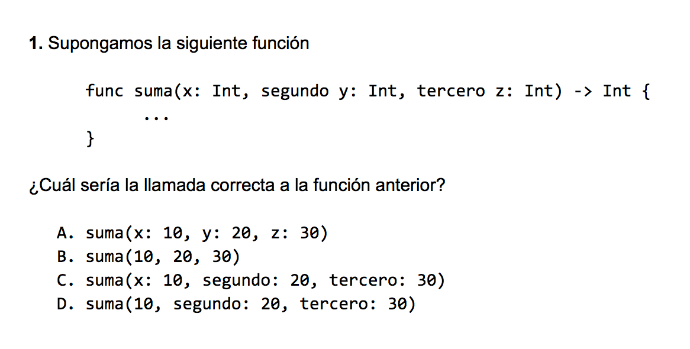
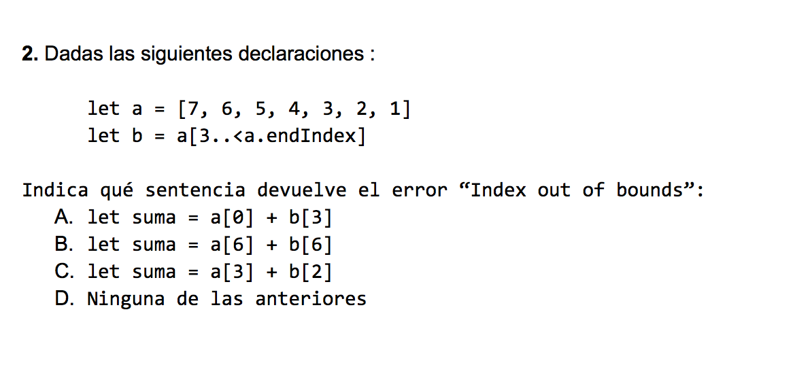
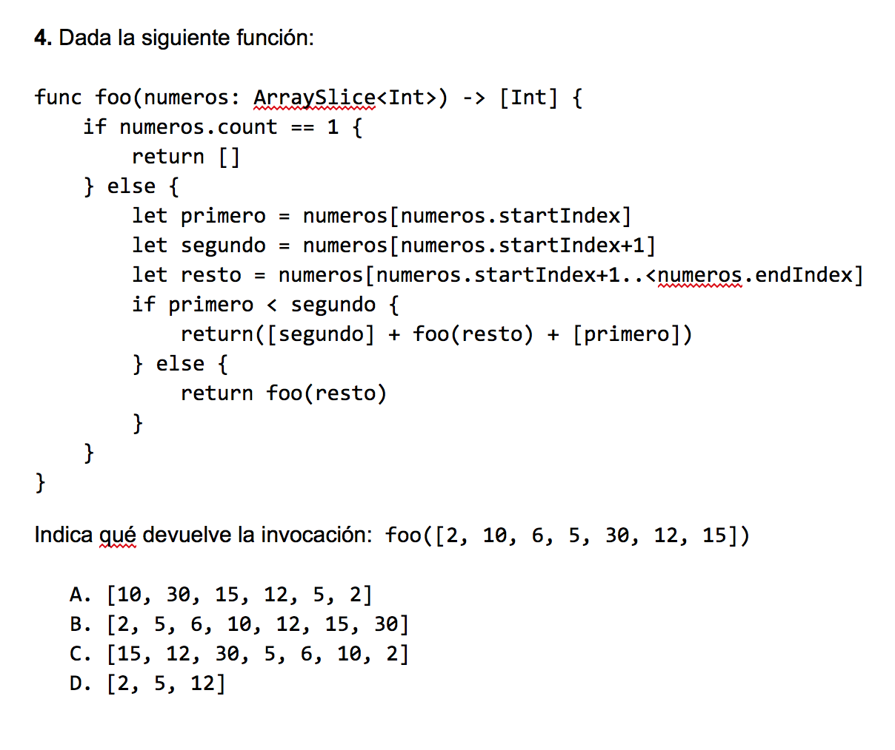

## Práctica 10: Introducción y programación funcional en Swift

Para entregar la práctica debes subir a Moodle el fichero
`practica10.swift` con una cabecera inicial con tu nombre y apellidos,
y las soluciones de cada ejercicio separadas por comentarios. Cada
solución debe incluir:

- La **definición de las funciones** que resuelven el ejercicio.
- Una visualización por pantalla de todos los ejemplos incluidos en el
  enunciado que **demuestren qué hace la función**.

#### Seminario de Swift

Antes de proceder a realizar los ejercicios de la práctica, debes
completar el
[seminario de Swift](https://github.com/domingogallardo/apuntes-lpp/blob/master/seminarios/seminario2-swift/seminario2-swift.md)
hasta el apartado de **Enumeraciones**.


#### Ejercicio 1

Escribe unas funciones en Swift que permitan calcular e imprimir las
frecuencias de un conjunto de respuestas, representadas como un array
de `Int`. Puedes definir las funciones que consideres necesario.

Como ejemplo de funcionamiento puedes ver el siguiente código:


```swift
let respuestas = [0,0,1,1,2,1,2,3,5,8,1,8,2,2,2,6,8]
print("Valores: \(respuestas)" )
let frec = obtenerFrecuencias(respuestas: respuestas)
print("Frecuencias: \(frec)")
print("\nHistograma")
print("----------")
imprimir(frecuencias: frec, maxAsteriscos: 10)
```

Sacaría por pantalla lo siguiente:


```
Valores: [0, 0, 1, 1, 2, 1, 2, 3, 5, 8, 1, 8, 2, 2, 2, 6, 8]
Frecuencias: [2, 4, 5, 1, 0, 1, 1, 0, 3]

Histograma
----------
0: ****
1: ********
2: **********
3: **
4: 
5: **
6: **
7: 
8: ******
```

El parámetro `maxAsteriscos` define el número de asteriscos de la
frecuencia máxima (en el caso anterior, el valor 2). Todos los demás
asteriscos están escalados proporcionalmente a este número máximo.


#### Ejercicio 2

**2.a)** Implementa en Swift la **función recursiva**
`compruebaParejas(_:funcion)` que recibe dos parámetros: un
`ArraySlice` de enteros y una función que recibe un entero y devuelve
un entero. La función devolverá un array de tuplas que contiene las
tuplas formadas por aquellos números contiguos del primer array que
cumplan que el número es el resultado de aplicar la función al número
situado en la posición anterior.

Ejemplo:

```swift
func cuadrado(x: Int) -> Int {
   return x * x
}
compruebaParejas([2, 4, 16, 5, 10, 100, 105], funcion: cuadrado)
// devuelve [(2,4), (4,16), (10,100)]
```

**2.b)** Implementa en Swift la **función recursiva**
`coinciden(parejas:ArraySlice<(Int,Int)>, funcion: (Int)->Int)` que devuelve un array de booleanos que
indica si el resultado de aplicar la función al primer número de
cada pareja coincide con el segundo.

```swift
let array = [(2,4), (4,14), (4,16), (5,25), (10,100)]
func cuadrado(x: Int) -> Int {
   return x * x
}
print("Resultado coinciden:  \(coinciden(parejas: ArraySlice(array), funcion: cuadrado))\n")
// Imprime: Resultado coinciden:  [true, false, true, true, true]
```


#### Ejercicio 3

Supongamos que estamos escribiendo un programa que debe tratar
movimientos de cuentas bancarias. Define un enumerado `Movimiento `
con valores asociados con el que podamos representar:

- Depósito (valor asociado: `(Double)`)
- Cargo de un recibo (valor asociado: `(String, Double)`)
- Cajero (valor asociado: `(Double)`)

Y define la función `aplica(movimientos:[Movimiento])` que reciba un
array de movimientos y devuelva el dinero resultante de acumular todos
los movimientos.

Ejemplo:


```swift
let movimientos: [Movimiento] = [.deposito(830.0), .cargoRecibo("Gimnasio", 45.0), .deposito(400.0), .cajero(100.0)]
print(aplica(movimientos: movimientos))
// Imprime 1085.0
```


#### Ejercicio 4

Implementa en Swift un tipo enumerado recursivo que permita construir
árboles binarios de enteros. El enumerado debe tener un caso en el que
guardar tres valores (un `Int`, y dos árboles binarios: el hijo
izquierdo y el hijo derecho) y otro caso constante: un árbol binario
vacío. Llamaremos al tipo `ArboBinario` y a los casos `nodo` y `vacio`.

Impleméntalo de forma que el siguiente ejemplo funcione correctamente:

```swift
let arbol: ArbolBinario = .nodo(8, .nodo(2, .vacio, .vacio), .node(12, .vacio, .vacio))
```

Implementa también la función `suma(_:)` que reciba una instancia de
árbol binario y devuelva la suma de todos sus nodos:

```swift
print(suma(arbol))
// Imprime: 22
```

#### Ejercicio 5

Responde a las siguientes preguntas de tipo test.







----

Lenguajes y Paradigmas de Programación, curso 2016-17  
© Departamento Ciencia de la Computación e Inteligencia Artificial, Universidad de Alicante  
Antonio Botía, Domingo Gallardo, Cristina Pomares  


