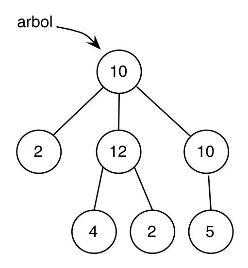

## Práctica 11: Programación Funcional en Swift (2)

Para entregar la práctica debes subir a Moodle el fichero
`practica11.swift` con una cabecera inicial con tu nombre y apellidos,
y las soluciones de cada ejercicio separadas por comentarios. Cada
solución debe incluir:

- La **definición de las funciones** que resuelven el ejercicio.
- Una visualización por pantalla de todos los ejemplos incluidos en el
  enunciado que **demuestren qué hace la función**.

**Pista**: Puedes encontrar las soluciones en Scheme a las funciones
  planteadas en estos ejercicios en el apartado de
  [árboles](http://domingogallardo.github.io/lpp/teoria/Tema03-ProcedimientosEstructurasRecursivas.html#3)
  del tema 3 de la asignatura. También en la
  [solución del segundo parcial](https://moodle2015-16.ua.es/moodle/pluginfile.php/89964/mod_forum/attachment/238501/SegundoParcialLPP2015-16.pdf).

#### Ejercicio 1

Definimos un árbol de enteros con el siguiente enumerado:

```swift
indirect enum Arbol {
    case Nodo(Int, [Arbol])
    case Hoja(Int)
}
```

Es una definición similar a la que vimos en Scheme. Se puede leer de
la siguiente forma: "Un `Arbol` es un enumerado que puede tener dos
subtipos con valores asociados. O bien es de subtipo `Nodo`, con
valores asociados un `Int` (el dato) y un array de `Arbol`es (los
árboles hijos), o bien es una `Hoja` con un valor `Int` asociado (el
dato)."

Implementa las funciones de la barrera de abstracción de árbol:

```swift
func datoArbol(arbol : Arbol) -> Int 
func hijosArbol(arbol : Arbol) -> [Arbol] 
func esHojaArbol(arbol : Arbol) ->  Bool 
```

Escribe un ejemplo de árbol con al menos 4 nodos y prueba varias
llamadas a las funciones de la barrera de abstracción para comprobar
que funcionan correctamente.


#### Ejercicio 2

Usando la barrera de abstracción anterior, implementa dos versiones de
la función `sumaArbol` que devuelve la suma de todos los `Int` de sus
nodos: usando recursión mutua y funciones de orden superior.

Para trabajar con arrays en lugar de con `ArraySlice` en la recursión
mutua podemos usar el siguiente código para obtener el primer elemento
y el resto.

```swift
let primero = bosque[0]
let resto = Array(bosque[1..<bosque.endIndex])
```

No es tan eficiente como trabajar con `ArraySlice`, pero hace el
código algo más sencillo de leer.

Implementa las funciones y pruébalas con el árbol representado en la
siguiente figura:




### Ejercicio 3

Implementa dos versiones (recursión mutua y FOS) de la función
`vecesArbol(_:dato:)` que recibe un árbol de enteros y un dato entero
y devuelve el número de veces que aparece el dato en el árbol.

Puedes ver un ejemplo (y la solución en Scheme) en el segundo parcial.


#### Ejercicio 4

Implementa dos versiones (recursión mutua y FOS) del predicado
`sumaHijosArbol(_:)` que recibe un árbol de números enteros y recorre
el árbol devolviendo `true` en caso de que para todos sus nodos
(excepto los nodos hoja) se cumpla que la suma de las raíces de los
hijos coincida con el dato del nodo.

Puedes ver un ejemplo (y la solución en Scheme) en el segundo parcial.

#### Ejercicio 5

Implementa una versión genérica del árbol del ejercicio 1 y de la
barrera de abstracción. Implementa una versión genérica de la función
suma, llamada `sumaArbolG`.

A continuación puedes ver un ejemplo de ejecución con un árbol de
enteros `Int` y un árbol de tuplas de parejas de enteros `(Int, Int)`:

```swift
print("Ejercicio 5")

//
// Árbol de Int
//

let arbolInt: ArbolG<Int> = .Node(8, [.Hoja(2), .Hoja(12)])
// tienes que rellenar correctamente los puntos suspensivos de la siguiente expresion
let sumaInt = sumaArbolG(arbolInt, suma: ..., neutro: ...)

print("La suma del arbol \(arbolInt) es \(sumaInt)")
// debe imprimir:
// "La suma del arbol Node(8, [main.ArbolG<Swift.Int>.Hoja(2), main.ArbolG<Swift.Int>.Hoja(12)]) es 22"

//
// Arbol de tuplas (Int, Int)
//

let t1 = (8,10)
let t2 = (2,7)
let t3 = (6,4)
let arbolTuplas: ArbolG<(Int,Int)> = .Node(t1, [.Hoja(t2), .Hoja(t3)])
// tienes que rellenar correctamente los puntos suspensivos de la siguiente expresion
let sumaTuplas = sumaArbolG(arbolTuplas, suma: ..., neutro: ...)

print("La suma del arbol \(arbolTuplas) es \(sumaTuplas)")
// debe imprimir:
// "La suma del arbol Node((8, 10), [main.ArbolG<(Swift.Int, Swift.Int)>.Hoja(2, 7), main.ArbolG<(Swift.Int, 
// Swift.Int)>.Hoja(6, 4)]) es (16, 21)"
```


----

Lenguajes y Paradigmas de Programación, curso 2015-16  
© Departamento Ciencia de la Computación e Inteligencia Artificial, Universidad de Alicante  
Antonio Botía, Domingo Gallardo, Cristina Pomares  


