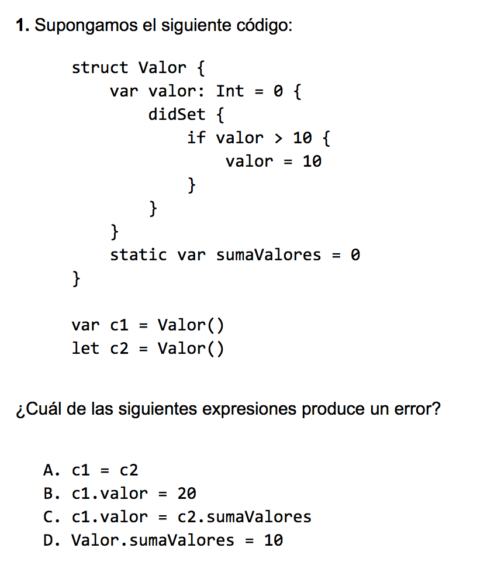
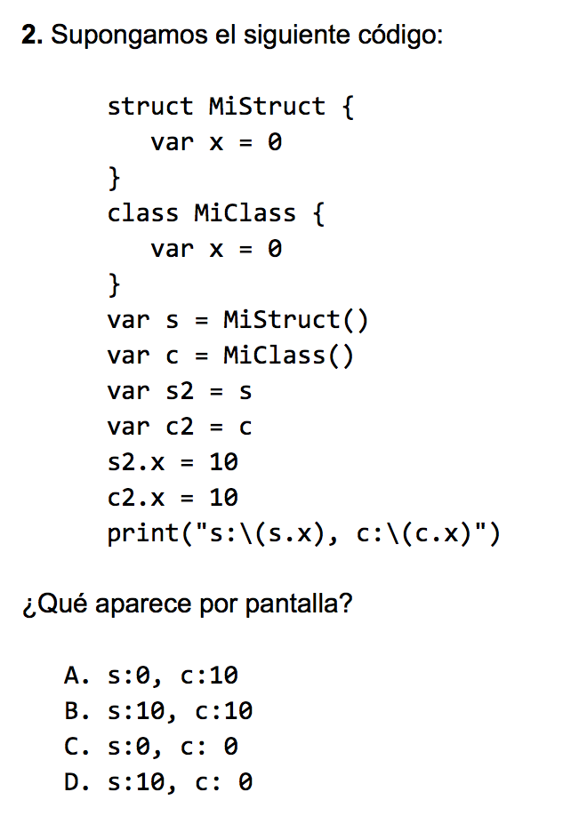
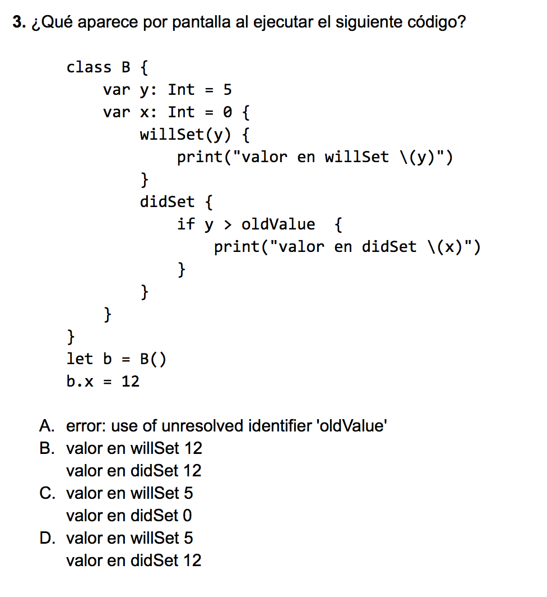
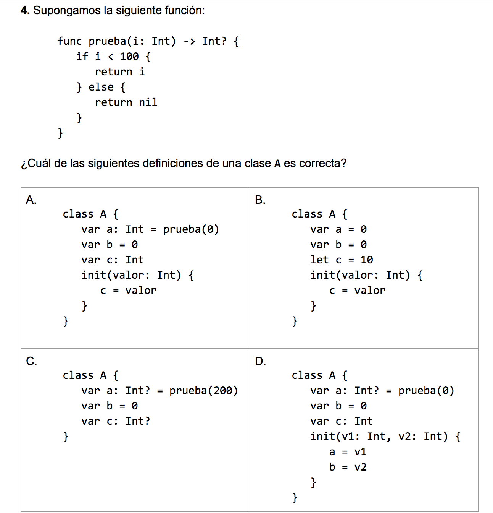

## Práctica 12: Programación Orientada a Objetos en Swift 1

Para entregar la práctica debes subir a Moodle el fichero `practica12.swift` con una cabecera inicial con tu nombre y apellidos, y las soluciones de cada ejercicio separadas por comentarios. 

### Ejercicio 1

En este ejercicio deberás implementar un conjunto de clases con las que podamos "simular" una carrera de coches.

#### Función `random`

Utilizaremos la función del sistema `random()` que devuelve un número
aleatorio. Hay que importar la librería `Glibc` (en Linux) y
`Foundation` (en iOS) para usarla.

A continuación puedes ver un ejemplo de su utilización en un método de
tipo del enumerado `MarcaCoche` para devolver una marca aleatoria de
coche:


```swift
import Glibc

func rand(n: Int) -> Int {
    return random() % n
}

enum MarcaCoche: Int {
    case Mercedes=0, Ferrari, RedBull, McLaren
    
    static func random() -> MarcaCoche {
        let maxValue = McLaren.rawValue
        
        let r = rand(maxValue+1)
        return MarcaCoche(rawValue: r)!
    }

}
```

#### Enumerados y clases que gestionan los vehículos

Deberás implementar los siguientes enumerados y clases, con las propiedades indicadas.

**Enumerado `MarcaCoche`** 

- Posibles valores: `Mercedes`, `Ferrari`, `RedBull` y `McLaren`
- Método del tipo `random()` que devuelva aleatoriamente uno de los
  valores (consultar el código anterior).

**Enumerado `TipoCambio`**

- Posibles valores: `Automatico` o `Manual`
- Método del tipo `random()` que devuelve uno de esos valores.

**Clase base `Coche`**

- Propiedades de instancia almacenadas: `velocidadActual` (`Double`),
  `marcha` (`Int`), `distanciaRecorrida` (`Double`) y `marca`
  (`MarcaCoche`).
- Propiedad de instancia calculada: `descripcion` (`String`), que
  devuelve la marca del coche.
- Propiedades del tipo: Constantes `velocidadMaxima` (`Double`) y
  `marchaMaxima` (`Int`) inicializadas a 150.0 y 6

**Subclase `CocheAutomatico`**

- Hereda de `Coche` y sobreescribe la descripción, añadiendo la cadena
  "Automático".

**Subclase `CocheManual`**

- Hereda de `Coche` y sobreescribe la descripción, añadiendo la cadena
  "Manual".

**Observadores de propiedades en las subclases**

La velocidad de un coche manual se modifica cambiando su propiedad
`marcha` y la de un coche automático cambiando su propiedad
`velocidadActual`. En cada caso hay que definir observadores de
propiedades que modifiquen la otra propiedad.

La velocidad se calcula a partir de la marcha según la siguiente expresión:

```swift
velocidadActual = 25.0 * marcha
```

Y la marcha se calcula a partir de la velocidad con la expresión que
puedes encontrar en los
[apuntes](http://domingogallardo.github.io/lpp/teoria/Tema06-ProgramacionOrientadaObjetosSwift.html).

**Distancia recorrida e información en pantalla**

Suponemos que se cambia la velocidad del coche cada hora y que en cada
cambio de velocidad se actualiza la propiedad `distanciaRecorrida`,
que irá acumulando la distancia recorrida por el coche desde su
inicialización. Cada vez que se cambia la velocidad también se
imprimirá la velocidad actual y la marca del coche en pantalla (ver el
ejemplo al final del ejercicio). Esto se puede implementar también en
los observadores.

#### Clase Carrera

Debes implementar las clases anteriores y una clase `Carrera` con la
que simular una carrera de `n` coches que conducen durante `k` horas.

Un ejemplo de uso de la clase `Carrera`:

```swift
let carrera = Carrera(numCoches: 2, horas: 3)
print("\nDescripción de la carrera:")
carrera.descripcion()
print("\n!!! Comienza la carrera !!!")
carrera.empezar()
print("\n!!! Clasificación !!!")
carrera.clasificacion()
```

Y su correspondiente salida por pantalla:

```text
Descripción de la carrera:
2 coches con una duración de 3 horas
 McLaren Automatico
 Mercedes Manual

!!! Comienza la carrera !!!

Horas transcurridas 1
McLaren Automatico viajando a 141.0 kilómetros por hora con la marcha 6
Mercedes Manual viajando a 25.0 kilómetros por hora con la marcha 1

Horas transcurridas 2
McLaren Automatico viajando a 114.0 kilómetros por hora con la marcha 5
Mercedes Manual viajando a 25.0 kilómetros por hora con la marcha 1

Horas transcurridas 3
McLaren Automatico viajando a 105.0 kilómetros por hora con la marcha 5
Mercedes Manual viajando a 100.0 kilómetros por hora con la marcha 4

!!! Clasificación !!!
1. McLaren Automatico (360.0 kilómetros recorridos)
2. Mercedes Manual (150.0 kilómetros recorridos)
```

### Ejercicio 2

En este ejercicio vamos a trabajar con estructuras y clases
geométricas: `Punto`, `Tamaño`, `Rectangulo`, `Circulo` y
`Triangulo`. Vamos a definir propiedades almacenadas y propiedades
calculadas para todas las figuras geométricas.

**Estructuras `Punto` y `Tamaño`**

Las debes declarar tal y como aparecen en los apuntes.

**Clase `Rectangulo`**

- Propiedades de instancia almacenadas: 
    - `origen` (`Punto`) que contiene las coordenadas de la esquina
      inferior izquierda del rectángulo.
    - `tamaño` (`Tamaño`) que contiene las dimensiones del rectángulo. 
    - Ambas propiedades se inicializan en un inicializador.
- Propiedades de instancia calculadas: 
    - `centro` (`Punto`, de lectura y escritura) que devuelve el
      centro del rectángulo. El `setter` modifica la posición del
      rectángulo manteniendo fijo su tamaño.
    - `area` (`Double`, sólo lectura ) que devuelve el área del rectángulo. 

**Clase `Circulo`**

- Propiedades de instancia almacenadas:
    - `centro` (`Punto`) que contiene las coordenadas del centro del
      círculo.
    - `radio` (`Double`) que contiene la longitud del radio.
    - Ambas propiedades se inicializan en un inicializador.
- Propiedades de instancia calculadas:
    - `area` (`Double`, de lectura y escritura) que devuelve el área
      del círculo. El `setter` modifica el tamaño del círculo (su
      radio), manteniéndolo en la misma posición.

**Clase `Triangulo`**

- Propiedades de instancia almacenadas:
    - `p1`, `p2`, `p3` (`Punto`) que contienen las coordenadas de los
      vértices del triángulo.
    - Se inicializan en un inicializador.
- Propiedades de instancia calculadas:
    - `centro` (`Punto`, de lectura y escritura) que devuelve el
      centro del triángulo. El `setter` modifica la posición del
      triángulo manteniendo fijo su tamaño.
    - `area` (`Double`, sólo lectura) que devuelve el área del triángulo.


**Estructura `AlmacenFiguras`**

- Propiedades de tipo almacenadas:
    - `rectangulos`, `circulos` y `triangulos` que contienen
      respectivamente arrays de rectángulos, círculos y
      triángulos. Inicializadas a arrays vacíos.
    - Se actualizan con cada nueva figura creada. En los
      inicializadores de `Rectangulo`, `Circulo` y `Triangulo` se debe
      incluir el código que añade la instancia recién creada al almacén
      de figuras.
- Propiedades de tipo calculadas:
    - `numFiguras` (`Int`) que devuelve el número total de figuras creadas.
    - `areaTotal` (`Double`) que devuelve la suma total de las áreas
      de todas las figuras creadas.

**Nota**: La implementación del almacén de figuras no es demasiado
  correcta, porque se utiliza una variable distinta para cada tipo de
  figura, sin generalizar. En la práctica de la semana que viene
  veremos cómo mejorarlo utilizando protocolos.

Implementa las estructuras y clases anteriores y escribe algunos
ejemplos de código para probarlas.


### Ejercicio 3

Responde a las siguientes preguntas de tipo test.

  
  
  



----

Lenguajes y Paradigmas de Programación, curso 2016-17  
© Departamento Ciencia de la Computación e Inteligencia Artificial, Universidad de Alicante  
Antonio Botía, Domingo Gallardo, Cristina Pomares  

