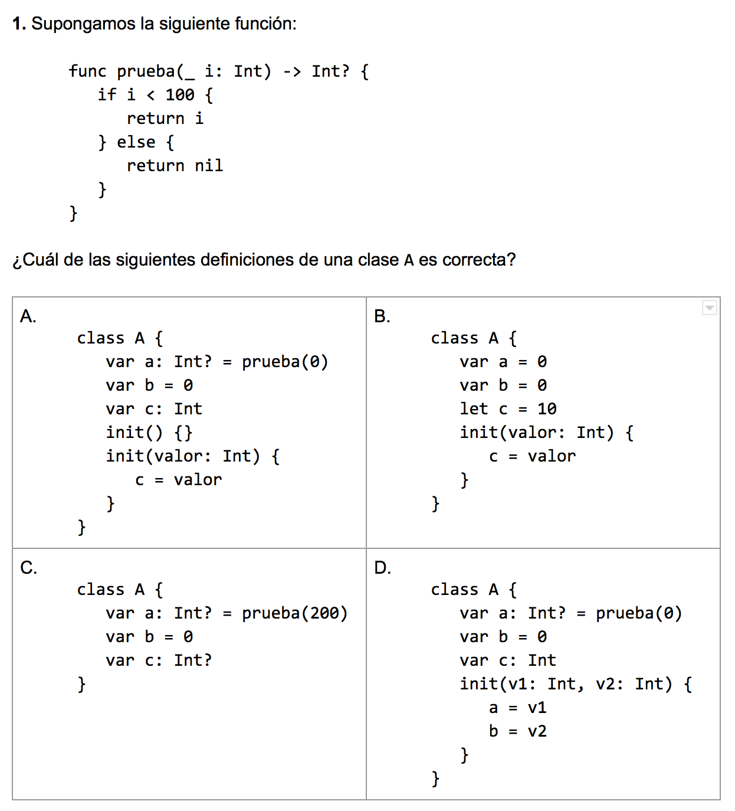
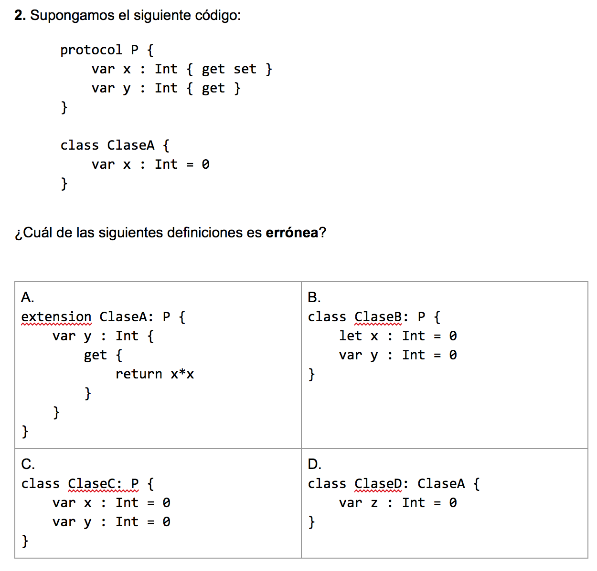
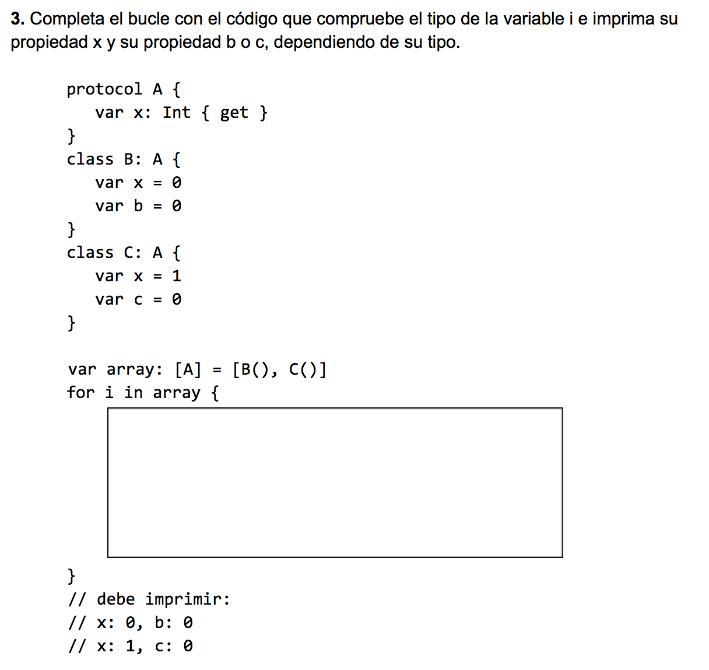

## Práctica 13: Programación Orientada a Objetos en Swift (2)

Para entregar la práctica debes subir a Moodle el fichero
`practica13.swift` con una cabecera inicial con tu nombre y apellidos,
y las soluciones de cada ejercicio separadas por comentarios.


### Ejercicio 1

En este ejercicio vamos a trabajar con algunos conceptos vistos en la
clase 2 del tema: protocolos, extensiones, casting de tipos y
funciones operadoras. 

Continuamos con el ejercicio de las figuras geométricas de la
práctica 12. 

Comienza incluyendo en la práctica el código de todas las definiciones
del ejercicio 2 de las estructuras y clases geométricas: `Punto`,
`Tamaño`, `Rectangulo`, `Circulo` y `Triangulo`.

Una vez incluido debes realizar lo siguiente.


#### Protocolo figura

Define el protocolo `Figura` que contiene:

- Propiedad de lectura y escritura `centro` (`Punto`), que define el
  centro de la figura.
- Propiedades de sólo lectura `area` (`Double`) y `tamaño` (`Tamaño`)
  que devuelven el tamaño (alto y ancho) de la figura.

Consideraremos el tamaño de un triángulo calculando las diferencias
entre las coordenadas mínimas y máximas en x e y.


#### Extensiones

- Define las extensiones necesarias para que las clases `Rectangulo`,
`Circulo` y `Triangulo` se ajusten al protocolo `Figura`, añadiendo el
código de implementación necesario.

- Añade mediante una extensión al protocolo `Figura` la propiedad
  calculada `descripcion` que devuelva un `String` con el centro y el
  área de la figura.

#### Clase `AlmacenFiguras`

- Reescribe la clase `AlmacenFiguras` y define en ella **una única
propiedad** `figuras` que contenga todas las figuras que se vayan
creando. Reescribe también la implementación de `areaTotal`. Modifica
los inicializadores en las clases geométricas para que se incluya la
figura recién creada en esta propiedad.

- Escribe el método de clase `cuentaTipos(figuras: [Figura]) -> (Int, Int, Int)`
que recibe un array de figuras y devuelve una tupla con tres enteros:
número de rectángulos, número de círculos y número de triángulos. La
función debe imprimir por cada figura del array, su descripción
por defecto proporcionada por el protocolo y el tipo de figura y sus
características específicas.

Por ejemplo:

```
- Descripción de la figura: Una figura con centro Punto(x: 7.0, y: 3.5) y área 50.0
  Rectangulo con origen Punto(x: 2.0, y: 1.0) y tamaño Tamaño(ancho: 10.0, alto: 5.0)
- Descripción de la figura: Una figura con centro Punto(x: 0.0, y: 2.0) y área 78.5398163397448
  Circulo con centro Punto(x: 0.0, y: 2.0) y radio 5.0
- Descripción de la figura: Una figura con centro Punto(x: 5.0, y: 2.0) y área 30.0
  Triangulo con vértices Punto(x: 0.0, y: 0.0) Punto(x: 10.0, y: 0.0) Punto(x: 5.0, y: 6.0)
```

#### Redefinición de la igualdad

Redefine los operadores de igualdad para todas las clases y
estructuras geométricas.


### Ejercicio 2

Responde a las siguientes preguntas de tipo test.

  
  



----

Lenguajes y Paradigmas de Programación, curso 2016-17  
© Departamento Ciencia de la Computación e Inteligencia Artificial, Universidad de Alicante  
Antonio Botía, Domingo Gallardo, Cristina Pomares  

