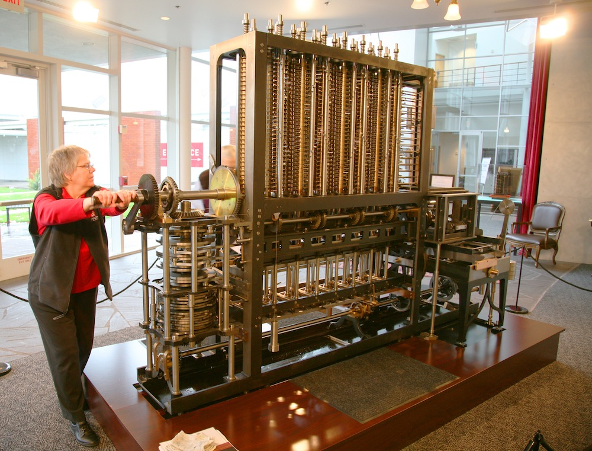
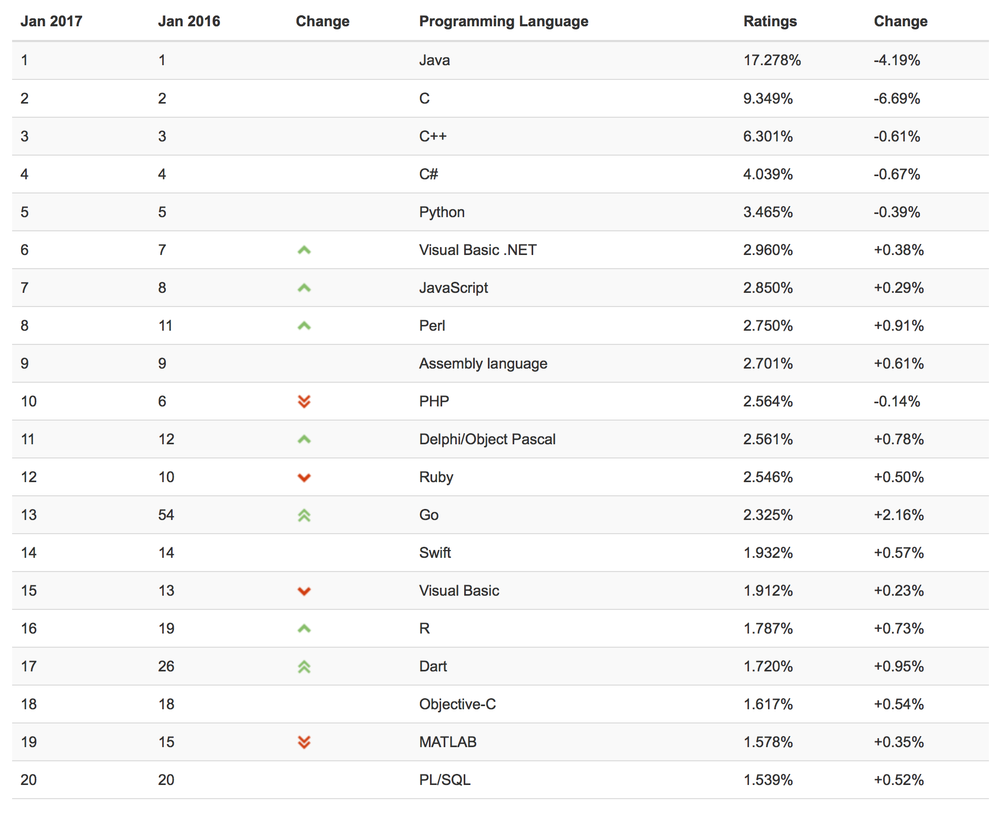
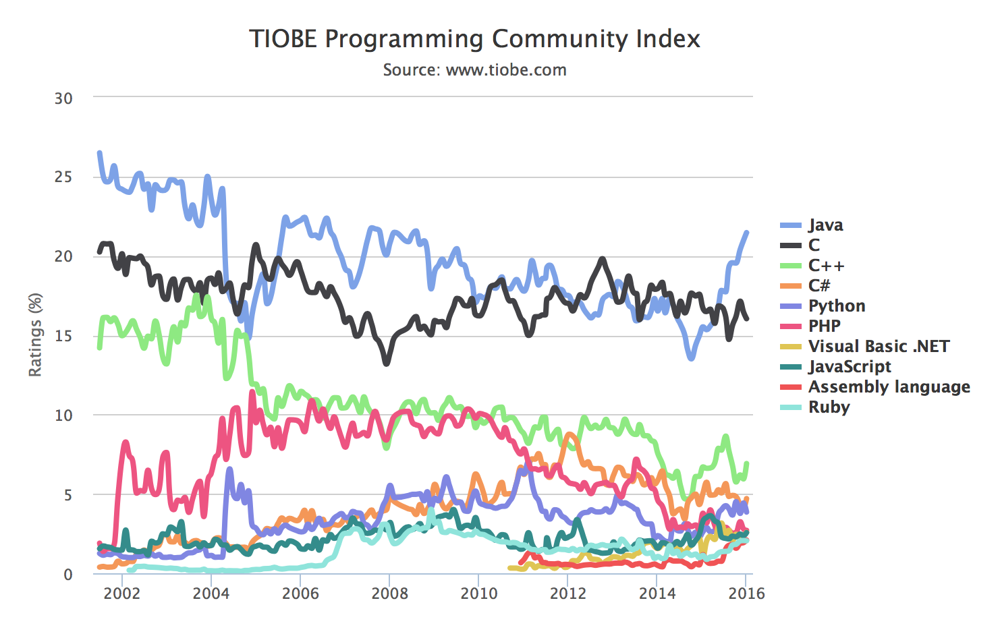

----

### Tema 1: Historia y conceptos de los lenguajes de programación

1. **Historia de los lenguajes de programación**
2. Elementos de los lenguajes de programación
3. Abstracción
4. Paradigmas de programación
5. Compiladores e intérpretes

----

### Objetivos del tema

- **Conocer la historia de los lenguajes de programación**
- **Conocer a los diseñadores de los lenguajes de programación**
- Conocer que **el diseño de nuevos lenguajes de programación es algo
  cada vez más habitual**
- Conocer distintas **definiciones** de *Lenguaje de Programación*
- Entender el concepto de **abstracción** y su importancia en la
  programación
- Comprender los distintos **tipos de ejecución de los lenguajes de
  programación**
- Conocer el concepto de **paradigma de programación y los paradigmas
  más importantes**

----

### Historia de los lenguajes de programación

- Un lenguaje de programación permite especificar programas que se
  ejecutan en computadores
- ¿Qué es un computador?
- Para entender qué es un computador vamos a usar un enfoque
  histórico: cómo evoluciona la idea de computador y cómo se ha ido
  programando a lo largo de la historia

----

### Calcular y computar

- En los siglos XVI y XVII se hace cada vez más necesario realizar
  cálculos matemáticos más rápido y con más precisión
- 1600: John Napier y las tablas de logaritmos
- _Computador_ (hasta los años 1940s): persona que que se contrata
  para realizar cálculos
- Ejemplo de problemas de errores en los cálculos: William Shanks
  calculó durante 15 años los 707 primeros decimales de pi (aunque
  sólo eran correctos los 527 primeros, cometió un error en el 528 que
  arrastró en el resto de dígitos). Publicó el resultado en el año
  1873.
- Máquinas de calcular *mecánicas* inventadas por científicos,
  relojeros y aficionados.

----

### Máquina de sumar del alemán Wilhelm Schickard (1623)

----

### Calculadora de Pascal (1650) (*Pascalina*),

- La primera máquina de calcular que podía hacer sumas, restas,
  multiplicaciones y divisiones:
- Se construyeron alrededor de 50 unidades.

----

### Motor de diferencias de Babbage (1820)

- Charles Babbage
- Objetivo: calcular e imprimir tablas numéricas de logaritmos
  utilizando el
  [método de las diferencias](http://acarol.woz.org/difference_engine.html#HowDoesDifferenceEngine)
- Sistema de numeración decimal
- Enorme diseño de más de 8.000 piezas movidas con una palanca
  giratoria
- Babbage trabajó durante varios años en la máquina sin poder
  completarla
- En 2002 el *Science Museum* de Londres presentó una reconstrucción
  totalmente funcional
  ([ver vídeo](http://www.youtube.com/watch?v=0anIyVGeWOI))

----

### Motor analítico de Babbage (1840)

- Babbage toma la idea de los telares programables que permiten
  dibujar distintos diseños a usar tarjetas perforadas
- Diseñado con la idea de usar tarjetas perforadas para realizar
  *cualquier cálculo* mediante programación
- También enorme máquina mecánica con un diseño de decenas de miles de
  piezas
- Babbage diseñó tres tipos de tarjetas: operaciones matemáticas,
  constantes numéricas y operaciones de carga y almacenamiento en la
  "memoria" de la máquina
- La máquina estaba diseñada para trabajar en base 10 y se podía
  conseguir que sus cálculos realizaran saltos condicionales y bucles
- Ada Lovelace tuvo un papel fundamental en la divulgación de la
  máquina, de sus sistema de programación y fue la primera que
  entendió sus posibilidades más allá del cálculo de fórmulas
- Babbage trabajó durante más de 30 años para intentar construir la
  máquina, se agotaron todos sus fondos y murió en 1871 habiendo
  podido construir sólo una parte

----

### Codificación de la información: tarjetas perforadas

- Tienen su origen en Herman Hollerith, que las inventó a finales del
  siglo XIX para automatizar el procesamiento del censo en los Estados
  Unidos
- Las tarjetas perforadas usadas en los primeros computadores utilizan
  una codificación
-
  [Simulador de tarjetas perforadas](http://www.kloth.net/services/cardpunch.php).

----

#### Relés electromecánicos

- Inventados alrededor de 1835
- Morse los utiliza en la patente del telégrafo (1837)
- Puerta AND implementada con dos relés electromecánicos:

----

### La máquina universal de Turing (1935)

- La Máquina de Turing es un *modelo computacional* que formula Alan
  Turing para estudiar matemáticamente cuáles son los límites del
  cálculo y la computación
- Turing lo inventa para contestar a a la pregunta ¿cuál es el modelo
  más simple que puede implementar un algoritmo?
- Una cinta con 0s y 1s que se mueve paso adelante o atrás, un cabezal
  que lee y escribe 0s y 1s y una tabla de estados que indica qué debe
  hacer el cabezal y la cinta
- Una tabla de estados define un algoritmo
- Máquina Universal de Turing: máquina con un algoritmo que permite
  simular cualquier otra máquina
- Origen del concepto de computador programable capaz de ejecutar
  cualquier algoritmo

----

### Resumen de avances importantes finales del siglo XIX y principios del XX

**Matemáticos y teóricos**

- (1850) Álgebra de Boole (AND, OR, NOT)
- (1900) Codificación de la información con tarjetas perforadas
- (1935) Máquina de Turing que define el concepto de computabilidad y
  Turing-completitud de los lenguajes de programación

**Tecnológicos**

- (1850) Relés electromecánicos (telégrafo)
- (1910) Válvulas de vacío permiten implementar los relés de forma
  electrónica
- (1937) Claude Shannon - Circuitos de relés para definir puertas
  lógicas, circuito de relés sumador en base 2

----

### La primera calculadora programable electromecánica

----

### 1941: la máquina de calcular Z3 de Zuse

- Electromecánica
- 2.300 relés

- Sólo podía ejecutar secuencias fijas de operaciones aritméticas en
  punto flotante (suma, resta, multiplicación, división y raíz
  cuadrada) codificadas en una cinta perforada
- El programa se codificaba en una cinta externa y se leía paso a paso
  de forma mecánica
- En sus instrucciones no existía el salto condicional.

El modelo computacional de la Z3 es el siguiente:

- Contiene registros de memoria denotados por letras (no se puede
  acceder de forma indirecta)
- La instrucción LOAD <registro> carga el contenido del registro (un
  número en punto flotante) como un operando de una operación
  matemática
- La instrucción STORE <registro> guarda el resultado de la operación
  en un registro

Un ejemplo de programa:

    LOAD b
    LOAD c
    op
    STORE a

***Tecnología***: electromecánica, relés  
***Programación***: cinta con instrucciones codificadas  
***Memoria***: 64 palabras de 22 bits en almacenadas en relés  
***Velocidad***: 1 instrucción por segundo  

----

### 1941-45: Los primeros computadores electrónicos

----

##### **ABC** (1942, USA)

- El profesor estadounidense John Vincent Atanasoff en la universidad
  de Iowa diseñan y desarrollan el primer computador totalmente
  electrónico, utilizando unas 300 válvulas de vacío (**ABC**,
  *Atanasoff-Berry Computer*).
- No se trataba de un computador genérico, sino de una máquina de
  cálculo orientada a la resolución de sistemas lineales de ecuaciones
  algebráicas
- Aunque la parte electrónica se terminó con éxito, el computador no
  llegó nunca a funcionar totalmente

***Tecnología***: electrónica, válvulas de vacío  
***Programación***: no es de propósito general, 
la entrada de datos y ecuaciones se hace con tarjetas perforadas    
***Memoria***: 60 números en representados en binario 
en palabras de 50 bits almacenadas en condensadores  
***Velocidad***: 30 sumas/restas por segundo  

----

### **Colossus** (1944, UK)

- Colossus es el primer computador electrónico digital capaz de
  funcionar de forma continua
- Se desarrolló en el centro de investigación británico de Bletchley
  Park en para automatizar la descodificación de los mensajes alemanes
  durante la Segunda Guerra Mundial
- Colossus fue diseñado y construido entre 1943 y 1944 por el
  matemático Max Newman y el ingeniero Tommy Flowers
- 1600 válvulas de vacío
- Colossus tampoco fue un computador general, aunque sus circuitos de
  válvulas podían realizar operaciones booleanas y contar, estaba
  diseñado para la descodificación de los alemanes

***Tecnología***: electrónica, válvulas de vacío  
***Programación***: no es de propósito general, la entrada/salida se 
realiza con una cinta de datos perforada e interruptores  
***Memoria***: no tiene elementos de memoria  

----

### **Mark-1** (1944, USA)

- Mark-1 fue diseñada por el profesor Howard Aiken de Harvard y
  construida por IBM
- El objetivo del Mark-1 era el cálculo de tablas resultantes de
  funciones matemáticas, por ejemplo, tablas balísticas para el
  lanzamiento de misiles.

***Tecnología***: electromecánica, relés  
***Programación***: programa codificado en una cinta, similar al Z3, sin operador 
de comparación, entrada de datos con 60 conjuntos de 24 interruptores   
***Memoria***: 72 números en codificación decimal de 23 dígitos  
***Velocidad***: 3 sumas/restas por segundo, una división tardaba 
15 segundos y un logaritmo o función trigonométrica alrededor de 1 minuto  

----

##### **ENIAC** (1945, USA)

- ENIAC es el primer computador electrónico construido en los EEUU, en
  la Moore School de la universidad de Pensilvania
- ENIAC tenía una tecnología similar a Colossus, pero era
  considerablemente más grande y más flexible (aunque aun estaba lejos
  de ser un computador de propósito general)
- La función principal de ENIAC fue el cálculo de tablas numéricas
  usadas para el cálculo de posición en los lanzamientos balísticos de
  misiles
- ENIAC no tenía tampoco un programa y para modificar su
  funcionamiento era necesario reconfigurar la máquina usando enchufes
  e interruptores

***Tecnología***: electrónica, 17.000 válvulas de vacío  
***Programa***: podía realizar bucles, condicionales o subrutinas, 
pero el programa se introducía modificando sus interruptores y clavijas. 
La entrada y salida de datos se realizaba con tarjetas perforadas  
***Memoria***: 20 registros decimales  
***Velocidad***: 5.000 sumas/restas por segundo  

----

### EDVAC: la arquitectura von Neumann (1945, USA)

- En 1944 John von Neumann se unió al grupo de desarrollo del ENIAC y
  aconsejó modificaciones en la arquitectura que llevaron, en 1948, a
  introducir un mecanismo primitivo de programa almacenado en memoria.
- En 1945, trabajando en la Universidad de Princeton (EEUU) escribió
  su famoso informe *First Draft of a Report on the EDVAC* en el que
  propone la arquitectura básica de un computador digital de propósito
  general con **programas almacenados en memoria** (*stored-program
  electronic computer*) que denominó **EDVAC**.
- Conjunto de operaciones similares a las del ensamblador de los
  procesadores actuales: almacenar valores en registros, copiar
  valores de la memoria a algún registro, ...
- Von Neumann trabajó desde 1945 hasta 1950 en la construcción de un
  computador con esa arquitectura en el Instituto for Advanced Study
  en Princeton.

----

### Programa almacenado en memoria (1946)

- En 1946 se celebraron en la Moore School conferencias y seminarios
  sobre el EDVAC y su arquitectura.
- El concepto de programa almacenado en memoria es clave en la
  historia de los lenguajes de programación.
- Desde el momento en que un programa se puede almacenar en memoria,
  se puede tratar de la misma forma que se tratan otros datos
- Aparecen los preprocesadores, lincadores, compiladores e
  intérpretes. Programas que procesan otros programas.

----

### **EDSAC** (1949, UK)

- El EDSAC fue uno de los primeros computadores en funcionamiento que
  utilizó la arquitectura von Neumann con el programa almacenado en
  memoria.
- Fue desarrollado por un equipo en UK dirigido por Maurice Wilkes
- Wilkes había asistido tres años antes a los seminarios de la Moore
  School en donde conoció los fundamentos de la arquitectura.

Para la programación del EDSAC, Wilkes estableció una biblioteca de
programas cortos llamados subrutinas almacenados en tarjetas
perforadas.

***Tecnología***: válvula de vacío  
***Programa***: almacenado en memoria, leído con tarjetas perforadas  
***Memoria***: 1000 palabras de 16 bits almacenadas en memorias 
de línea de retardo de mercurio  
***Velocidad***: 714 operaciones por segundo

----

### **Máquina de Manchester** (1948, UK)

- Una vez terminada la guerra, después de trabajar en el diseño de
  Colossus, Max Newmann crea el *Computing Machine Laboratory* en la
  universidad de Manchester.
- El primer computador electrónico digital de propósito digital con
  programa almacenado se construyó en este laboratorio. Se conoció con
  el nombre de *Manchester 'Baby'*.
- Primer computador con un conjunto de instrucciones completo, capaz
  de realizar saltos, condicionales y direccionamiento indirecto
- La primera ejecución de un programa fue el 21 de junio de 1948
- En esa fecha Alan Turing se incorporó a la universidad de
  Manchester, como director del Laboratorio de Computación
- En 1951 se convirtió en el primer computador disponible
  comercialmente, el **Ferranti Mark I**.
- El primero se instaló en la universidad de Manchester en febrero de
  1951, un mes antes que el UNIVAC I fuera entregado al Departamento
  de Censo de los EEUU. - Se vendieron otras 10 máquinas a Gran
  Bretaña, Canadá, Holanda e Italia.
- El primer programa complejo de Inteligencia Artificial, un jugador
  de damas escrito por Christopher Strachey, se ejecutó en el verano
  de 1952 en el Ferranti Mark I en el Laboratorio de Computación de
  Manchester.
- Strachey escribió el programa animado por Turing y usando el manual
  de programación del Ferranti que Turing acababa de escribir
- Turing participó también en el desarrollo de otros programas de IA,
  como un jugador de ajedrez basado en heurísticas.

----

### Los primeros lenguajes de programación

- Los primeros computadores electrónicos se programan directamente
  usando el conjunto de instrucciones del procesador, en código
  máquina, código hexadecimal
- A finales de la década de los 40 se empiezan a intentar resolver con
  los primeros computadores los primeros problemas matemáticos
  distintos de operaciones numéricas: codificación y descodificación,
  problemas combinatorios como el coloreado del mapa o problemas de
  ordenación.
- Uno de los primeros algoritmos de von Neumann realiza una ordenación
  de un conjunto de números. Von Neumann lo describe en una carta
  fechada en 1945. Utiliza el conjunto de instrucciones del EDSAC
  cuando todavía no se había construido:

----

### Características esenciales de un computador

- Computación universal: Un computador se dice que es universal cuando
  su conjunto de instrucciones permite realizar cualquier programa
  computable. De forma teórica un computador es universal cuando es
  posible simular con él una máquina de Turing.
- Un computador universal debe tener suficiente memoria accesible por
  referencia, acceso indirecto, como mínimo un acumulador y ser capaz
  de ejecutar el conjunto de instrucciones CLR (clear), INC
  (increment), LOAD, STORE, and BZ (branch if zero) (Raul Rojas,
  Konrad Zuse's Legacy).

----

### El nacimiento de los computadores comerciales (1951)

- El [UNIVAC](http://en.wikipedia.org/wiki/UNIVAC_I) fue el primer
  computador comercial (1951). Con este computadora aparece por
  primera vez la figura del programador: manuales, cursos de
  formación, ofertas de empleo, etc.
- Instalaciones comerciales del UNIVAC:

----

### Manual de programación del UNIVAC (1959)

- Los computadores son lentos y muy complicados de instalar y
  mantener, son más importantes las horas de funcionamiento del
  computador que las horas de trabajo del programador.
- La complejidad de las tareas a programar es pequeña y es suficiente
  con los programas en ensamblador
- El
  [manual de 1959 de programación del UNIVAC](http://www.bitsavers.org/pdf/univac/univac1/UNIVAC1_Programming_1959.pdf)
  es una referencia histórica de gran interés de la que hemos extraído
  las siguientes imágenes:

- Se realizan los primeros anuncios y reportajes de televisión sobre
  computadores
  ([YouTube](https://www.youtube.com/watch?v=Pd63MHGQygQ))

----

### IBM 704

- El [IBM 704](http://en.wikipedia.org/wiki/IBM_704) fue el otro gran
  ordenador comercial de la década de los 50.
- Tuvo una difusión mucho mayor que el UNIVAC: centros
  gubernamentales, universidades.
- Los primeros lenguajes de programación de alto nivel se desarrollan
  para este computador.

----

### Los primeros lenguajes de alto nivel

----

### FORTRAN y Lisp (1956 y 1958)

* FORTRAN
	* Primer lenguaje comercial, equipo de IBM dirigido por John W. Backus
	* Lenguaje imperativo: estado, estructuras de control, contador de programa, celdas de memoria
	* Lenguaje compilado
* Lisp
	* Lenguaje diseñado en un departamento de investigación, un equipo del MIT dirigido por John McCarthy
	* Lenguaje funcional: funciones, recursión, listas, símbolos
	* Lenguaje interpretado

----

### FORTRAN

Desarrollado por IBM para programar el IBM 704. Algunos datos:

- Su nombre proviene de *FORmula TRANslating system*.
- El primer manual de FORTRAN se imprime en octubre de 1956 para el
  IBM 704.
- El primer compilador se comercializa en abril de 1956.

Cita de John Backus
([Wikipedia sobre FORTRAN](http://en.wikipedia.org/wiki/Fortran)):

> Much of my work has come from being lazy. I didn't like writing
> programs, and so, when I was working on the IBM 701, writing
> programs for computing missile trajectories, I started work on a
> programming system to make it easier to write programs.

*John Backus*

*Ejemplo FORTRAN*

Tomado del
[manual de FORTRAN del IBM 704](http://archive.computerhistory.org/resources/text/Fortran/102665486.05.01.acc.pdf)

----

### Lisp

- El otro lenguaje de alto nivel desarrollado en esa época es el Lisp.
- Lenguaje de alto nivel para procesar listas e implementar programas
  de inteligencia artificial
- Lenguaje interpretado, basado en la definición interactiva de
  funciones y en la recursión
- Desarrollado a finales de los 50 en el MIT por John McCarthy

*John McCarthy*

Uno de los primeros manuales de Lisp publicados es el
[manual de LISP](http://bitsavers.org/pdf/mit/rle_lisp/LISP_I_Programmers_Manual_Mar60.pdf)
de 1960 para el IBM 704 escrito por Phyllis A. Fox. del grupo de
investigación del MIT dirigido por McCarthy.

Un ejemplo de código Lisp:

*Ejemplo LISP*

Tomado de
"[The Programming Language LISP](http://www.softwarepreservation.org/projects/LISP/lisp15_family#Berkeley_and_Bobrow_)",
MIT Press, 1964

----

### La explosión de los lenguajes de programación

Desde 1954 hasta la actualidad se han documentado más de 2.500
(consultar en [The Language List]).  Entre 1952 y 1972 alrededor de
200 lenguajes. Una decena fueron realmente siginificativos y tuvieron
influencia en el desarrollo de lenguajes posteriores.

[The Language List]: http://people.ku.edu/~nkinners/LangList/Extras/langlist.htm

----

### Genealogía de los lenguajes de programación

----

### Algunos lenguajes importantes y su fecha de creación

| 1950-1960  | 1970  | 1980 | 1990 | 2000 |
| :--------- | :---: | :---: | :---: | ---: |
| 1957 FORTRAN | 1970 Pascal     | 1980 Smalltalk-80   |  1990 Haskell   | 2000 C#  |  
| 1958 ALGOL |  1972 Prolog  | 1983 Objective-C   | 1991 Python   | 2003 Scala  |  
| 1960 Lisp | 1972 C | 1983 Ada   |  1993 Ruby  | 2003 Groovy  |  
| 1960 COBOL | 1975 Scheme | 1986 C++  | 1995 Java  | 2009 Go  |  
| 1962 APL |  1975 Modula   | 1986 Eiffel   |   |  2014 Swift |  
| 1964 BASIC |      | 1987 Perl   |    |   |  
| 1967 SIMULA |      |    |    |   |  

----

### Los creadores de los LPs

Si comprobamos la historia de los lenguajes de programación, podemos
clasificar a sus creadores en tres grandes categorías:

* Investigadores trabajando en empresas
([Backus](http://en.wikipedia.org/wiki/John_Backus), IBM-FORTRAN,
[Gosling](http://en.wikipedia.org/wiki/James_Gosling), Sun-Java)
* Investigadores en universidades y departamentos de Informática
  ([McCarthy](http://en.wikipedia.org/wiki/John_McCarthy_(computer_scientist)),
  MIT-Lisp, [Wirth](http://en.wikipedia.org/wiki/Niklaus_Wirth),
  ETH-Pascal, [Odersky](http://en.wikipedia.org/wiki/Martin_Odersky),
  EHT-Scala)
* Desarrolladores open source que distribuyen su trabajo a la
  comunidad ([Wall](http://en.wikipedia.org/wiki/Larry_Wall), Perl,
  [Matsumoto](http://en.wikipedia.org/wiki/Yukihiro_Matsumoto), Ruby)

----

### Lenguajes de programación en la actualidad

El índice
[TIOBE](http://www.tiobe.com/index.php/content/paperinfo/tpci/index.html)
es un indicador de la popularidad de los lenguajes de programación.

También es muy interesante comprobar la evolución de los 10 lenguajes
más populares en los últimos 10 años.

----

### La evolución no se detiene

Ejemplos de nuevos lenguajes y sus creadores:

**Ruby**

*Yukihiro Matsumoto*

* [Ruby](http://www.ruby-lang.org/)
  ([Wikipedia](https://en.wikipedia.org/wiki/Ruby_(programming_language))),
  un lenguaje de programación ideado en 1993 por el desarrollador
  japonés Yukihiro Matsumoto
* Lenguaje multi-paradigma interpretado y muy expresivo que
  actualmente se utiliza tanto para desarrollar aplicaciones web como
  videojuegos.
* Proyecto vivo, cada año aparecen nuevas versiones

**Scala**

*Martin Odersky*

* [Scala](http://www.scala-lang.org/)
  ([Wikipedia](https://en.wikipedia.org/wiki/Scala_(programming_language))),
  diseñado en 2003 por el profesor alemán Martin Odersky
* Respuesta a los problemas de los lenguajes tradicionales imperativos
  para manejar la concurrencia
* Está implementado sobre Java y corre en la Máquina Virtual Java

**Go**

*Ken Thompson*

* [Go](http://golang.org/)
  ([Wikipedia](https://en.wikipedia.org/wiki/Go_(programming_language))),
  el nuevo lenguaje de programación de Google lanzado en 2009
* Desarrollado, entre otros, por Ken Thompson, uno de los padres del
  UNIX
* Una mezcla de C y Python que intenta conseguir un lenguaje de
programación de sistemas muy eficiente, expresivo y también
multiparadigma.

**Swift**

*Chris Lattner*

* [Swift](https://developer.apple.com/swift/)
  ([Wikipedia](https://en.wikipedia.org/wiki/Swift_(programming_language))),
  el nuevo lenguaje de programación de Apple lanzado en 2014
* [Proyecto _open source_](https://swift.org) en el que se puede
  observar su
  [evolución y _roadmap_ futuro](https://github.com/apple/swift-evolution)
* Desarrollado, entre otros, por
  [Chris Lattner](http://www.nondot.org/sabre/), autor del sistema
  _LLVM Compiler Infrastructure_, conjunto de compilador, depurador,
  optimizador, etc. de código C, C++ y Objective-C.
* Lenguaje moderno, multiparadigma (programación orientada a objetos y
  funcional) fuertemente tipeado y compilado.

----

