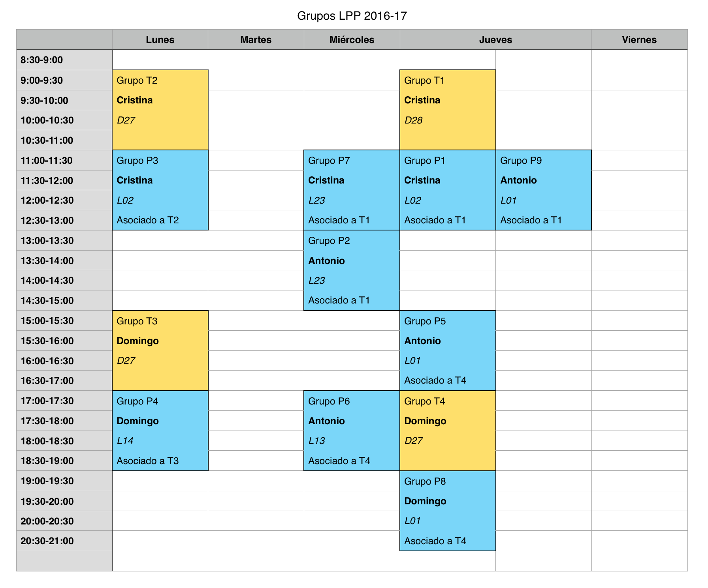

## Lenguajes y Paradigmas de Programación

Toda la información está disponible en el [sitio Moodle de LPP](https://moodle2016-17.ua.es/moodle/course/view.php?id=942) y en la
[ficha del campus virtual](http://cv1.cpd.ua.es/ConsPlanesEstudio/cvFichaAsiEEES.asp?wCodEst=C203&wcodasi=34017&wLengua=C&scaca=2016-17).

### Datos académicos de la asignatura

**Departamento de Ciencia de la Computación e Inteligencia Artificial**  
**6 créditos ECTS**: 1 clase de teoría de 2 h. y 1 clase de 
prácticas de 2 h. a la semana  
**Profesores**:  

* Antonio Botía ([e-mail](mailto:abotia@dccia.ua.es)): Grupos de prácticas: 2, 5, 6, y 9.
* Domingo Gallardo ([e-mail](mailto:domingo.gallardo@ua.es)): Profesor coordinador de la asignatura. Grupos de teoría: 3 y 4. Grupos de prácticas: 4 y 8.
* Cristina Pomares ([e-mail](mailto:cpomares@ua.es)): Grupos de teoría: 1 y 2. Grupos de prácticas: 1, 3 y 7.

### Recursos de la asignatura

* [Sitio Moodle](https://moodle2016-17.ua.es/moodle/course/view.php?id=942)
  abierto y accesible a toda la comunidad educativa, contiene los
  apuntes, transparencias, prácticas y otros materiales docentes
* [Foro de consultas y anuncios](https://moodle2016-17.ua.es/moodle/mod/forum/view.php?id=8086)
  en el sitio Moodle (sólo accesible a estudiantes)

### Objetivos y competencias

**Objetivos**:

* ¿Qué elementos son comunes a los lenguajes de programación? 
* ¿Qué familias o paradigmas de lenguajes podemos identificar? 
* ¿Qué es la programación funcional?
* ¿Cómo es un lenguaje multi-paradigma que combina la programación
  funcional y la programación orientada a objetos?
 
Dominando estos contenidos será mucho más fácil aprender nuevos
lenguajes de programación, identificar sus aspectos esenciales e
incluso ser capaz de diseñar lenguajes específicos orientados a
dominios concretos.

**Competencias**:

* Conocer y diferenciar las características de los distintos
  paradigmas de programación (programación funcional, procedural y
  orientada a objetos) e identificarlas en lenguajes de programación
  concretos.
* Diferenciar entre tiempo de ejecución y tiempo de compilación en
  distintos ámbitos: detección de errores o definición, creación o
  ámbito de vida de variables.
* Conocer los principios básicos de la programación funcional:
  recursión, inmutabilidad, funciones como objetos de primera clase,
  funciones de orden superior, expresiones lambda (clausuras).
* Conocer los problemas derivados del uso de la mutación en los
  lenguajes de programación imperativos y la forma de trabajar con
  estructuras inmutables en lenguajes declarativos y funcionales.
* Utilizar la abstracción y la recursión para diseñar correctamente
  procedimientos y estructuras de datos (listas y árboles).
* Ser capaz de diseñar, implementar y corregir programas funcionales,
  en concreto utilizando el lenguaje de programación Scheme.
* Ser capaz de implementar programas sencillos en Swift, en los que se
  utilicen las características multi-paradigma del lenguaje.
* Comparar el paradigma orientado a objetos con el paradigma
  procedural clásico, reconociendo las ventajas que aporta en cuanto a
  abstracción, reutilización y modificación de código.

### Temario

* Tema 1. **Lenguajes de programación**: Historia de los lenguajes de
  programación. Elementos de los lenguajes de
  programación. Abstracción. Paradigmas de programación. Compiladores
  e intérpretes.
* Tema 2. **Programación Funcional**: Características e historia del
  paradigma de Programación Funcional. Características declarativas
  del paradigma funcional. Definición de funciones. Funciones como
  datos de primer orden. La forma especial lambda. Ámbito de variables
  y closures. Datos compuestos en Scheme: parejas. Construcción,
  recorrido y operaciones sobre listas. Listas con elementos
  compuestos. Listas de listas.
* Tema 3. **Procedimientos recursivos**:  Diseño de
  funciones recursivas. Recursión mutua. Procesos recursivos e
  iterativos. Memoization. Recursión y gráficos de tortuga. 
* Tema 4. **Estructuras recursivas**: Estructuras de datos recursivas:
  listas estructuradas y árboles.
* Tema 5. **Programación Imperativa**: Historia del paradigma de
  programación imperativo. Características principales. Datos
  mutables. Datos mutables en Scheme. Estructuras de datos mutables en
  Scheme. Ámbito de variables dinámico y modelo de entornos en
  Scheme. Estado local.
* Tema 6. **Programación funcional en Swift**: Lenguajes
  multiparadigma. Programación funcional en Swift. Valores
  opcionales. Listas. Recursión pura y recursión por la
  cola. Funciones como datos de primer orden. Clousures y funciones
  anónimas. Funciones de orden superior: mappings y filtros de
  colecciones.
* Tema 7. **Programación Orientada a Objetos en Swift**: Características e
  historia del paradigma de Programación Orientada a
  Objetos. Estructuras y clases en Swift. Herencia. Conceptos
  avanzados de POO en Swift: Extensiones, Protocolos y
  Genéricos. Gestión de errores.

Seminarios:

* Seminario 1. **El lenguaje de programación Scheme**:
  Primitivas. Tipos de datos
  básicos. Símbolos. Cadenas. Listas. Definición de funciones.
* Seminario 2. **El lenguaje de programación Swift**. Intérprete y
  scripts. Tipos de datos básicos. Operadores. Estructuras de
  control. Ámbito de variables. Tipos de datos compuestos: tuplas,
  arrays y colecciones. Recorriendo colecciones. Valores mutables e
  inmutables. Inicialización. Tipos de referencia y valor en Swift.

El calendario de temas, prácticas y exámenes está disponible en Moodle.

### Prácticas

Durante las horas prácticas se realizarán de forma individual
ejercicios de programación relacionados con los conceptos que se están
estudiando en ese momento que servirán para reforzar y profundizar en
las competencias de la asignatura. Para el desarrollo de las prácticas
utilizaremos los siguientes lenguajes de programación y entornos de
desarrollo:

* [Racket](http://racket-lang.org/) (versión de Scheme, lenguaje de
  programación funcional)
* [Swift](https://swift.org) (lenguaje multiparadigma creado por
  Apple, con conceptos modernos de programación funcional y
  programación orientada a objetos)

Se realizarán 12 sesiones de ejercicios de prácticas de una semana de
duración y 2 seminarios de lenguajes. En las sesiones de ejercicios de
prácticas se propondrá una hoja de ejercicios con 5 o 6 problemas de
programación relacionados con el tema de la sesión de teoría. Los
ejercicios se resolverán de forma individual y se entregarán en Moodle
en la fecha indicada. Cuando todos los grupos hayan entregado las
prácticas, se publicará una hoja de soluciones con distintas
soluciones posibles para los ejercicios planteados.

Al comienzo de cada sesión de prácticas el profesor resolverá dudas
sobre la última hoja de soluciones publicada. Después se trabajará en
la hoja de ejercicios de la semana actual y el profesor estará
disponible para resolver dudas y dar pistas sobre cómo atacar los
problemas.

### Horarios

La distribución de grupos del curso 2016-17 es la siguiente:

### Evaluación

#### Convocatoria normal (evaluación continua)

En la convocatoria de junio se realizará una evaluación continua con
tres exámenes parciales, que ponderarán un 33%, 33% y 34% en la nota
final.

Las entregas de las prácticas no ponderarán para la calificación
final, pero son esenciales para el aprendizaje de los conceptos y
técnicas de la asignatura. Junto con la realización de las prácticas,
también recomendamos encarecidamente la revisión de sus soluciones
(que iremos publicando también semana a semana) y de los ejemplos
de código presentados en teoría.

#### Convocatoria extraordinaria

En la convocatoria de julio se realizará un examen final sobre todos
los contenidos impartidos en el curso.

#### Consejos para aprender con éxito los contenidos de la asignatura

El consejo fundamental para aprobar la asignatura es **trabajar todas
las semanas e intentar seguir el ritmo de la asignatura**. Los
conceptos de la asignatura se van construyendo de forma progresiva y
lo visto en una semana depende muchas veces de lo aprendido en semanas
anteriores.

¿Cómo estudiar estos conceptos? Con la excepción de algunos temas y
apartados concretos (como la historia de los lenguajes de programación
o las características de los distintos paradigmas) la asignatura es
fundamentalmente práctica. Cuando hablamos de *estudiar* los ejemplos
de código queremos decir **entenderlos, no aprenderlos de
memoria**. No tiene sentido aprender de memoria los ejercicios y los
ejemplos vistos en clase. Hay que *trabajarlos*. Eso significa que,
primero, hay que entenderlos sobre el papel y *muy importante* hay que
**probar todos los ejemplos en el intérprete (el REPL)**. Y *probar*
significa escribir los ejemplos y jugar con ellos, proponiendo
pequeñas variantes, preguntándose *¿qué pasaría si...?* y probándolo.

En cuanto a las prácticas y a los ejercicios propuestos es fundamental
pelearse con ellos e intentar hacerlos por uno mismo **sin ver ninguna
solución**. Es la única forma de aprender: probando, equivocándose y
encontrando la solución por uno mismo.

A la hora de enfrentarse con un problema es fundamental también **usar
lápiz y papel** para probar enfoques y encontrar la solución más
sencilla sobre el papel antes de probarla en el REPL. Los ejercicios
que proponemos no son excesivamente complicados. Todos se resuelven
con muy pocas líneas de código y su codificación en el ordenador no
tiene dificultad, una vez que se ha encontrado la solución que lo
resuelve. Al usar el lápiz y papel también estarás practicando una
situación similar a la que te vas a encontrar en los exámenes de la
asignatura.

Resumiendo: trabajar todas las semanas, hacer uno mismo todos los
ejercicios y no desanimarse ni descolgarse.

Son muy interesantes algunos comentarios de antiguos estudiantes que
han aprobado la asignatura.

Cómo dominar los conceptos:

> "Para superar la asignatura lo que hice fue estudiar mucho. Hay que
> practicar y sobre todo entender los ejercicios y no sabérselos de
> memoria. Una vez dominados los ejercicios yo mismo me propuse
> variantes de los mismos. Así es como se domina."

El problema del cambio de paradigma:

> "El problema principal de la asignatura es enfrentarse a un cambio
> del paradigma de programación."

Trabajar día a día:

> "Lo que hice fue tratar de llevar al día toda la asignatura, además
> de trabajar con material adicional para poder ampliar y profundizar
> conocimientos. LPP es una asignatura de fondo en la que tienes que
> mantener el ritmo de trabajo de principio a fin de cuatrimestre."

No copiar las prácticas:

> "El mayor problema que creo que existe es que muchas personas se
> relajan y se copian las prácticas en cuanto les resultan un poco
> difíciles o les lleva algo mas del tiempo que les gustaría. Esta
> asignatura si no haces tu los ejercicios y te peleas con ellos es
> prácticamente imposible de sacar."

No memorizar:

> "Otra de las cosas es que tienes que cambiar la forma de estudiar,
> no vale memorizar, ni hacer muchos ejercicios sin más. Tienes que
> entender bien el funcionamiento de la recursión para luego poder
> practicar con ejercicios, sino no sirve. [...] En mi opinión el
> problema de LPP para mucha gente es que para los exámenes se
> memorizan los ejercicios de prácticas de las soluciones que se dan
> en clase. [...] Por último, otro problema es la carga de trabajo que
> se tiene en grado, no con esta asignatura que de verdad realiza
> evaluación continua, pero te encuentras con otras cuatro asignaturas
> que te piden un mínimo en exámenes parciales, otro en prácticas con
> más carga lectiva que esta asignatura y además un examen final que
> incluye toda la asignatura y al final la asignatura que menos bien
> llevas ( o peor) es la que terminas abandonando.

Plantearse uno mismo problemas:

> "Los problemas que me encontré a la hora de cursar LPP fue que eran
> dos lenguajes completamente nuevos, otro tipo de programación que
> nunca había visto, otra forma de estudiar distinta. Para poder
> superarla simplemente tienes que hacer ejercicios y también
> plantearte tú mismo nuevos ejercicios."

### Bibliografía

En Moodle se publican los apuntes de la asignatura, con ejercicios,
explicaciones y ejemplos de todos los conceptos estudiados, tanto en
teoría como en práctica.

Para ampliar algunos conceptos se recomiendan los dos siguientes manuales:

* Harold Abelson y Gerald Jay Sussman, *Structure and Interpretation
  of Computer Programs*, MIT Press, 1996
* [Enlace a la edición on-line](http://mitpress.mit.edu/sicp/full-text/book/book.html)
* Signatura en la Biblioteca Politécnica: I.06/ABE/STR

* Apple, *The Swift Programming Language (Swift 3.0.1)*, 2016
* [Web](https://developer.apple.com/library/ios/documentation/Swift/Conceptual/Swift_Programming_Language/)

----

Lenguajes y Paradigmas de Programación, curso 2015-16
© Departamento Ciencia de la Computación e Inteligencia Artificial, Universidad de Alicante  
Domingo Gallardo, Cristina Pomares, Antonio Botía
