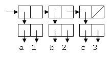
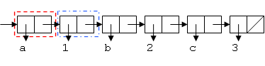
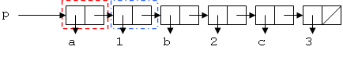
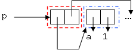
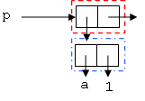

# Tema 5: Programación imperativa

## Contenidos

- [1. Historia y características de la programación imperativa](#1)
    - [1.1. Historia de la programación imperativa](#1-1)
	- [1.2. Características principales de la programación imperativa](#1-2)
- [2. Programación imperativa en Scheme](#2)
    - [2.1. Pasos de ejecución](#2-1)
	- [2.2. Mutación con formas especiales *set!*](#2-2)
	- [2.3. Igualdad de referencia y de valor](#2-3)
- [3. Estructuras de datos mutables](#3)
    - [3.1. Mutación de elementos](#3-1)
	- [3.2. Funciones mutadoras: `append!`](#3-2)
    - [3.3. Lista ordenada mutable](#3-3)
	- [3.4. Diccionario mutable](#3-4)
	- [3.5. Ejemplo de mutación con listas de asociación](#3-5)
- [4. Ámbitos de variables y clausuras](#4)
    - [4.1. Variables de ámbito global](#4-1)
    - [4.2. Variables de ámbito local](#4-2)
    - [4.3. Clausuras y estado local](#4-3)
- [5. Clausuras con mutación = estado local mutable](#5)
    - [5.1. Estado local mutable](#5-1)
	- [5.2. Paso de mensajes](#4-2)

## Bibliografía

En este tema explicamos conceptos de los siguientes capítulos del libro *Structure and Intepretation of Computer Programs*:

- [3.3.1 Mutable List Structure](https://mitpress.mit.edu/sicp/full-text/book/book-Z-H-22.html#%_sec_3.3.1)
- [3.3.2 Representing Queues](https://mitpress.mit.edu/sicp/full-text/book/book-Z-H-22.html#%_sec_3.3.2)
- [3.3.3 Representing tables](https://mitpress.mit.edu/sicp/full-text/book/book-Z-H-22.html#%_sec_3.3.3)
- [3.1.1 Local State Variables](https://mitpress.mit.edu/sicp/full-text/book/book-Z-H-20.html#%_sec_3.1.1)
- [3.1.3 The Cost of Introducing Assignment](https://mitpress.mit.edu/sicp/full-text/book/book-Z-H-20.html#%_sec_3.1.3)

## <a name="1"></a> 1. Historia y características de la programación imperativa

### <a name="1-1"></a>1.1. Historia de la programación imperativa

#### 1.1.1. Orígenes de la programación imperativa

- La programación imperativa es la forma natural de programar un
  computador, es el estilo de programación que se utiliza en el
  ensamblador, el estilo más cercano a la arquitectura del computador
- Características de la arquitectura
  [arquitectura clásica de Von Newmann](http://en.wikipedia.org/wiki/Von_Neumann_architecture):
	- memoria donde se almacenan los datos (referenciables por su
      dirección de memoria) y el programa
	- unidad de control que ejecuta las instrucciones del programa
      (contador del programa)
	- Los primeros lenguajes de programación (como el Fortran) son
      abstracciones del ensamblador y de esta arquitectura. Lenguajes
      más modernos como el BASIC o el C han continuado con esta idea.

#### 1.1.2. Programación procedural

- Uso de procedimientos y subrutinas
- Los cambios de estado se localizan en estos procedimientos
- Los procedimientos especifican parámetros y valores devueltos (un
  primer paso hacia la abstracción y los modelos funcionales y
  declarativos)
- Primer lenguaje con estas ideas: ALGOL

#### 1.1.3. Programación estructurada

- Artículo a finales de los 60 de Edsger W. Dijkstra:
  [GOTO statement considered harmful](http://www.cs.utexas.edu/users/EWD/ewd02xx/EWD215.PDF)
  en el que se arremete contra la sentencia GOTO de muchos lenguajes
  de programación de la época
- La programación estructurada mantiene la programación imperativa,
  pero haciendo énfasis en la necesidad de que los programas sean
  correctos (debe ser posible de comprobar formalmente los programas),
  modulares y mantenibles.
- Lenguajes: Pascal, ALGOL 68, Ada

#### 1.1.4. Programación Orientada a Objetos

- La POO también utiliza la programación imperativa, aunque extiende
  los conceptos de modularidad, mantenibilidad y estado local
- Se populariza a finales de los 70 y principios de los 80

### <a name="1-2"></a> 1.2. Características principales de la programación imperativa

- Idea principal de la programación imperativa: la computación se
  realiza cambiando el estado del programa por medio de sentencias que
  definen pasos de ejecución del computador
- Estado del programa modificable
- Sentencias de control que definen pasos de ejecución

Vamos a ver unos ejemplos de estas características usando el lenguaje
de programación Java.

#### 1.2.1. Modificación de datos

- Uno de los elementos de la arquitectura de Von Newmann es la
  existencia de celdas de memoria referenciables y modificables

```java
int x = 0;
x = x + 1;
```

- Otro ejemplo típico de este concepto en los lenguajes de
  programación es el array: una estructura de datos que se almacena
  directamente en memoria y que puede ser accedido y modificado.
- En Java los arrays son tipeados, mutables y de tamaño fijo

```java
String[] unoDosTres = {"uno","dos","tres"};
unoDosTres[0] = unoDosTres[2];
```
	
- Un ejemplo de un método que recibe un parámetro de tipo array en
  Java. El parámetro se pasa por referencia:

```java
public void llenaCadenas(String[] cadenas, String cadena) {
    for (int i = 0; i < cadenas.length; i++) {
        cadenas[i] = cadena;
    }
}
```

- Todos los ejemplos anteriores en un programa `main` Java:

```java
public class Main {

    public static void main(String[] args) {
        int x = 0;
        x = x + 1;
        System.out.println("x: " + x);
        String[] unoDosTres = {"uno","dos","tres"};
        unoDosTres[0] = unoDosTres[2];
        for (String valor : unoDosTres) {
            System.out.println(valor);
        }
        llenaCadenas(unoDosTres, "uno");
        for (String valor : unoDosTres) {
            System.out.println(valor);
        }
    }

    public static void llenaCadenas(String[] cadenas, String cadena) {
        for (int i = 0; i < cadenas.length; i++) {
            cadenas[i] = cadena;
        }
    }
}
```

#### 1.2.2. Almacenamiento de datos en variables

- Todos los lenguajes de programación definen variables que contienen
  datos
- Las variables pueden mantener valores (tipos de valor o value types)
  o referencias (tipos de referencia o reference types)
- En C, C++ o Java, los datos primitivos como int o char son de tipo
  valor y los objetos y datos compuestos son de tipo referencia
- La asignación de un valor a una variable tiene implicaciones
  distintas si el tipo es de valor (se copia el valor) o de referencia
  (se copia la referencia)

Copia de valor (datos primitivos en Java):

```java
int x = 10;
int y = x;
x = 20;
System.out.println(y); // Sigue siendo 10
```

Copia de referencia (objetos en Java):

```java
// import java.awt.geom.Point2D;
Point2D p1 = new Point2D.Double(2.0, 3.0);
Point2D p2 = p1;
p1.setLocation(12.0, 13.0);
System.out.println("p2.x = " + p2.getX()); // 12.0
System.out.println("p2.y = " + p2.getY()); // 13.0
```

- El uso de las referencias para los objetos de clases y para los
  tipos compuestos está generalizado en la mayoría de lenguajes de
  programación
- Tiene efectos laterales pero permite obtener estructuras de datos
  eficientes

#### 1.2.3. Igualdad de valor y de referencia

- Todos los lenguajes de programación imperativos que permite la
  distinción entre valores y referencias implementan dos tipos de
  igualdad entre variables
- Igualdad de valor (el contenido de los datos de las variables es el
  mismo)
- Igualdad de referencia (las variables tienen la misma referencia)
- Igualdad de referencia => Igualdad de valor (pero al revés no)

- En Java la igualdad de referencia se define con `==` y la de valor
  con el método `equals`:

```java
Point2D p1 = new Point2D.Double(2.0, 3.0);
Point2D p2 = p1;
Point2D p3 = new Point2D.Double(2.0, 3.0);
System.out.println(p1==p2);           // true
System.out.println(p1==p3);           // false
System.out.println(p1.equals(p3));    // true
```

#### 1.2.4. Sentencias de control

- También tiene su origen en la arquitectura de Von Newmann
- Sentencia que modifica el contador de programa y determina cuál será
  la siguiente instrucción a ejecutar
- Tipos de sentencias de control en programación estructurada:
	- Las sentencias de secuencia definen instrucciones que son ejecutados una detrás de otra de 
	forma síncrona. Una instrucción no comienza hasta que la anterior ha terminado.
	- Las sentencias de selección definen una o más condiciones que determinan las instrucciones 
	que se deberán ejecutar.
	- Las sentencias de iteración definen instrucciones que se ejecutan de forma repetitiva hasta 
	que se cumple una determinada condición.

**Bucles y variables**

Ejemplo imperativo que imprime en Java una tabla con los productos de
los números del 1 al 9:

```java
for (int i = 1; i <= 9 ; i++) {
    System.out.println("Tabla del " + i);
    System.out.println("-----------");
    for (int j = 1; j <= 9; j++) {
        System.out.println(i + " * " + j + " = " + i * j);
    }
    System.out.println();
}
```	

## <a name="2"></a> 2. Programación imperativa en Scheme

- Al igual que LISP, Scheme tiene características imperativas
- Vamos a ver algunas de ellas
	- Pasos de ejecución
	- Asignación con la forma especial `set!`
	- Datos mutables con las formas especiales `set-car!` y `set-cdr!`
- Una nota importante: todos los ejemplos que hay a continuación
  necesitan importar la librería `mutable-pairs`:

```scheme
#lang r6rs
(import (rnrs)
      (rnrs mutable-pairs))
```


### <a name="2-1"></a> 2.1. Pasos de ejecución

- Es posible definir pasos de ejecución con la forma especial `begin`
- Todas las sentencias de la forma especial se ejecutan de forma
  secuencial, una tras otra
- Tanto en la definición de funciones como en `lambda` es
  posible definir cuerpos de función con múltiples sentencias que se
  ejecutan también de forma secuencial. Hasta ahora no hemos usado
  esta característica porque hemos utilizado Scheme de forma
  funcional.

Ejemplo `begin`:

```scheme
(begin
    (display "Escribe un número: ")
    (define x (read))
    (display "Escribe otro: ")
    (define y (read))
    (define maximo (max x y))
    (display (string-append "El máximo de "
                        (number->string x)
                        " y "
                        (number->string y)
                        " es "
                       (number->string maximo))))
```

Ejemplo de pasos de ejecución en la definición de una función:

```scheme
(define (display-tres-valores a b c)
    (display a)
    (newline)
    (display b)
    (newline)
    (display c)
    (newline))
```

### <a name="2-2"></a> 2.2. Mutación con formas especiales *set!*

#### 2.2.1. Forma especial `set!`

- La forma especial `set!` permite asignar un nuevo valor a una
  variable
- La variable debe haber sido previamente creada con `define`
- La forma especial no devuelve ningún valor, modifica el valor de la
  variable usada

Sintaxis:

```text
(set! <variable> <nuevo-valor>)
```

Por ejemplo, la típica asignación de los lenguajes imperativos se
puede realizar de esta forma en Scheme:

```scheme
(define a 10)
(set! a (+ a 1))
a  ; ⇒ 11
```

La forma especial `set!` funciona con cualquier tipo de datos. Por
ejemplo, utilizando la característica de que Scheme es débilmente
tipeado, puede incluso asignar un nuevo tipo de valor a una variable:

```scheme
(define a "Hola")
a ; ⇒ "Hola"
(set! a (cons 1 2))
a ; ⇒ {1 . 2}
```
	
#### 2.2.2. Datos mutables

- En Scheme se definen las formas especiales `set-car!` y `set-cdr!`
  que permite modificar (mutar) la parte izquierda o derecha de una
  pareja una vez creada
- Al igual que `set!`, no devuelven ningún valor

Sintaxis:

```text
(set-car! <pareja> <nuevo-valor>)
(set-cdr! <pareja> <nuevo-valor>)
```

Ejemplo

```scheme
(define p (cons 1 2))
(set-car! p 10)
(set-cdr! p 20)
p	; ⇒ (10 . 20)
```

#### 2.2.3. Efectos laterales

- La introducción de la asignación y los datos mutables hace posible
  que Scheme se comporte como un lenguaje imperativo en el que más de
  una variable apunta a un mismo valor y se producen efectos laterales
- Un efecto lateral se produce cuando el valor de una variable cambia
  debido a una sentencia en la que no aparece la variable
- Podemos comprobar ahora que las parejas son datos que se copian por
  referencia

Ejemplo:

```scheme
(define p1 (cons 1 2))
(define p2 p1)
p1 ; ⇒ (1 . 2)
p2 ; ⇒ (1 . 2)
(set-car! p1 20)
p1 ; ⇒ (20 . 2)
p2 ; ⇒ (20 . 2)
```

### <a name="2-3"></a> 2.3. Igualdad de referencia y de valor

- La utilización de referencias, la mutación y los efectos laterales
  hace también necesario definir dos tipos de igualdades: igualdad de
  referencia e igualdad de valor.
- Igualdad de referencia: dos variables son iguales cuando apuntan al
  mismo valor
- Igualdad de valor: dos variables son iguales cuando contienen el
  mismo valor
- En Scheme la función `eq?` comprueba la igualdad de referencia y
  `equal?` la igualdad de valor
- Igualdad de referencia implica igualdad de valor, pero no al revés

Ejemplo:

```scheme
(define p1 (cons 10 20))
(define p2 p1)
(define p3 (cons 10 20))
(equal? p3 p1)  ; ⇒ #t
(eq? p3 p1) ; ⇒ #f
(eq? p2 p1) ; ⇒ #t
(set! p3 p1) ;; La asignación copia referencias
(eq? p3 p1) ; ⇒ #t
```

## <a name="3"></a> 3. Estructuras de datos mutables

- La utilización de las formas especiales `set-car!` y `set-cdr!`
  permite un estilo nuevo de manejo de las estructuras de datos ya
  vistas (listas o árboles)
- Es posible implementar funciones más eficientes que actualizan la
  estructura modificando directamente las referencias de unas celdas a
  otras
- Las operaciones no construyen estructuras nuevas, sino que modifican
  la ya existente

### <a name="3-1"></a> 3.1. Mutación de elementos

Vamos a empezar con un ejemplo sencillo en el que vamos a mutar un
elemento de una estructura de datos formada por parejas. Supongamos la
siguiente estructura:

```scheme
(define datos (cons 2
                    (cons (cons 5
                                (cons 8 9))
                          (cons 3 4))))
```

El diagrama *box-and-pointer* es el siguiente. Fíjate que hay
elementos de las parejas que son datos atómicos y otros que son
referencias a otras parejas.


Vamos ahora a *mutar* la estructura utilizando las sentencias
`set-car!` y `set-cdr!`. Para mutar una pareja acceder a la pareja y
modificar su parte derecha o su parte izquierda con las sentencias
anteriores.

Por ejemplo, ¿cómo cambiaríamos el `8` por un `18`? Deberíamos obtener
la pareja `(8 . 9)` que está al final de la estructura y modificar su
parte izquierda:

```scheme
(set-car! (cdr (car (cdr datos))) 18)
```

La expresión `(cdr (car (cdr datos)))` devuelve la pareja que queremos
modificar y la sentencia `set-car!` modifica su parte izquierda.

Si ahora vemos qué hay en `datos` veremos que se ha modificado la
estructura:

```scheme
(print-pareja datos)
; ⇒ (2 . ((5 . (18 . 9)) . (3 . 4)))
```

Recuerda que `print-pareja` es una función que vimos anteriormente.

Hemos mutado un dato por otro. También podemos mutar las referencias a
las parejas. Por ejemplo, podríamos modificar la parte derecha de la
pareja que contiene el 5 para que apunte a la pareja `(3 . 4)`:


Para ello habría que obtener la pareja que contiene el 5 con la
expresión `(car (cdr datos))` y mutar su parte derecha (`set-cdr!`)
con la referencia a la pareja `(3 . 4)` que se obtiene con la
expresión `(cdr (cdr datos))`:

```scheme
(set-cdr! (car (cdr datos)) (cdr (cdr datos)))
```

### <a name="3-2"></a> 3.2. Funciones mutadoras: `append!`

- Normalmente las funciones mutadoras no devuelven una estructura,
  sino que modifican la que se pasa como parámetro
- Por convenio, indicaremos que una función es mutadora terminando su
  nombre con un signo de admiración


Como ejemplo inicial, la siguiente función es la versión mutadora de
`append`.  La llamamos `append!`:


```scheme
(define (append! l1 l2)
    (if (null? (cdr l1))
        (set-cdr! l1 l2)
        (append! (cdr l1) l2)))
```

Ejemplo:
	      
```scheme
(define a '(1 2 3 4))
(define b '(5 6 7))
(append! a b)
a ; ⇒ (1 2 3 4 5 6 7)
```

Algunas puntualizaciones:

- Al igual que `set!`, `set-car!` o `set-cdr!`, la función `append!`
  no devuelve ningún valor, sino que modifica directamente la lista
  que se pasa como primer parámetro
- Al modificarse la lista, todas las referencias que apuntan a ellas
  quedan también modificadas
- La función daría un error en el caso en que la llamáramos con una
  lista vacía como primer argumento

### <a name="3-3"></a> 3.3. Lista ordenada mutable

Vamos a presentar un tipo de dato mutable completo, una lista ordenada
en la que insertaremos elementos de forma ordenada.

La barrera de abstracción del tipo de dato `olist` es la siguiente:

- `(make-olist)`: devuelve una lista ordenada vacía
- `(primero-olist olist)`: devuelve el primer elemento de una lista ordenada
- `(resto-olist olist)`: devuelve el resto de la lista ordenada
- `(vacia-olist? olist)`: devuelve `#t` o `#f` dependiendo de si la
  lista tiene o no elementos
- `(borra-primero-olist! olist)`: elimina (con mutación) el primer
  elemento de la lista
- `(inserta-olist! olist n)`: inserta (con mutación) de forma ordenada
  un número en la lista

Implementaremos el tipo de datos con una lista normal con una pareja
adicional en cabeza. Esta pareja adicional funcionará de **cabecera de
la lista** y será la referencia inmutable a la que apuntará cualquier
variable que apunte a la lista. De esta forma podremos insertar
elementos en primera posición de la lista. En la cabecera usaremos por
convenio el símbolo `'*olist*'`.

```scheme
(define lista '(*olist* 10 20 30))
```


**Selectores**

La implementación de los selectores es la siguiente:


```scheme
(define (primero-olist olist)
    (cadr olist))

(define (resto-olist olist)
    (cdr olist))

(define (vacia-olist? olist)
    (null? (cdr olist)))
```

- La función `first-olist` devuelve el primer elemento de la lista
  ordenada. Devuelve el `cadr` para saltar la cabecera.
- La función `empty-olist?` devuelve `#t` si la lista ordenada tiene
  algún elemento. Para ello comprueba si hay alguna pareja tras la
  cabecera.
- La función `rest-olist` devuelve el resto de la lista
  ordenada. Devuelve la referencia a la segunda pareja de la lista
  original. Esta pareja hará de cabecera de la lista devuelta,
  conteniendo en su parte izquierda el primer elemento de la lista
  original (no importa, porque puede haber cualquier valor como
  cabecera).

Por ejemplo, puedes comprobar en el siguiente código el funcionamiento
de estos selectores:

```scheme
(define lista '(*olist* 10 20))
(primero-olist lista) ; ⇒ 10
(primero-olist (resto-olist lista)) ; ⇒ 20
(vacia-olist? (resto-olist (resto-olist lista))) ; ⇒ #t
```

**Constructor**

El constructor `(make-olist)` devuelve una lista sólo con la cabecera.

```scheme
(define (make-olist)
    (list '*olist*))
```

**Mutadores**

Las funciones mutadoras modifican la estructura de datos.

Comenzamos con la función `(borra-primero-olist! olist)` que elimina
con mutación el primer elemento de la lista ordenada:


```scheme
(define (borra-primero-olist! olist)
    (set-cdr! olist (cddr olist))
    olist)
```

Definimos la función mutadora `inserta-olist!` que modifica la lista
ordenada añadiendo una nueva pareja, insertándola en la posición
correcta modificando las referencias.

La función `(add-item! item ref)` es la función clave que crea una
nueva pareja con el `item` y la añade en el `cdr` de la pareja a la
que apunta `ref`.

```scheme
(define (add-item! ref item)
    (set-cdr! ref (cons item (cdr ref))))

(define (inserta-olist! olist n)
    (cond 
        ((null? (cdr olist)) (add-item! olist n))
        ((< n (cadr olist)) (add-item! olist n))
        ((= n (cadr olist)) #f)   ; el valor devuelto no importa
        (else (inserta-olist! (cdr olist) n))))
```


Ejemplo de uso:

```scheme
(define c (make-olist))
(inserta-olist! c 5)
(inserta-olist! c 8)
```

### <a name="3-4"></a> 3.4. Diccionario mutable

- Veamos ahora un ejemplo más: un _diccionario_ mutable definido
  mediante una lista de asociación formada por parejas de clave y
  valor

```scheme
(define l-assoc (list (cons 'a 1) (cons 'b 2) (cons 'c 3)))
```
	
- La función de Scheme `assq` recorre la lista de asociación y
  devuelve la tupla que contiene el dato que se pasa como parámetro
  como clave

```scheme
(assq 'a l-assoc) ; ⇒ (a.1)
(assq 'b l-assoc) ; ⇒ (b.2)
(assq 'c l-assoc) ; ⇒ (c.3)
(assq 'd l-assoc) ; ⇒  #f
(cdr (assq 'c l-assoc)) ; ⇒ 3
```

- La función `assq` busca en la lista de asociación usando la igualdad
  de referencia `eq?`

```scheme
(define p (cons 1 2))
(define l-assoc (list (cons 'a 1) (cons p 2) (cons 'c 3)))
(assq (cons 1 2) l-assoc) ; ⇒ #f
(assq p l-assoc) ; ⇒ {{1 . 2} . 2}
```

La barrera de abstracción del mapa es la siguiente:

- `(make-dic)`: construye un diccionario vacío
- `(put-dic! dic clave valor)`: inserta en el diccionario un nuevo
  valor asociado a una clave
- `(get-dic dic clave)`: devuelve el valor asociado a una clave en un
  diccionario

```scheme
(define (make-dic)
  (list '*dic*))

(define (get-dic dic clave)
    (define pareja (assq clave (cdr dic)))
    (if (not pareja)
        #f
        (cdr pareja))))

(define (put-dic! dic clave valor)
    (define pareja (assq clave (cdr dic)))
    (if (not pareja)
        (set-cdr! dic
                  (cons (cons clave valor)
                        (cdr dic)))
        (set-cdr! pareja valor)))
  'ok)
```

En las funciones anteriores usamos la forma especial `define` en el
interior de una función. Veremos más adelante que esta es la forma de
definir una variable local a la función.

Ejemplos de uso:
  
```scheme
(define dic (make-dic))
(put-dic! dic 'a 10) ; ⇒ ok
(get-dic dic 'a) ; ⇒ 10
(put-dic! dic 'b '(a b c)) ; ⇒ ok
(get-dic dic 'b) ; ⇒ {a b c}
(put-dic! dic 'a 'ardilla) ; ⇒ ok
(get-dic dic 'a) ; ⇒ ardilla
```

### <a name="3-5"></a> 3.5. Ejemplo de mutación con listas de asociación

Una vez introducidos distintas estructuras de datos mutables,
incluyendo listas de asociación, vamos a terminar estos ejemplos con
un ejemplo práctico en el que intervienen las listas y las listas de
asociación. Se trata de escribir un procedimiento `regular->assoc!`
que transforme una lista regular en una lista de asociación sin crear
nuevas parejas. La lista regular `(k1 v1 k2 v2 k3 v3 ...)` deberá
convertirse en la lista de asociación `((k1 . v1) (k2 . v2) (k3 . v3)
...)`.

Ejemplo:

```scheme
(define my-list (list 'a 1 'b 2 'c 3))
my-list ; ⇒ (a 1 b 2 c 3)
(regular->assoc! my-list)
my-list ; ⇒ ((a . 1) (b . 2) (c . 3))
```

Una posible solución a este problema sería la siguiente (no es la
única solución):

Cuando trabajamos con este tipo de problemas, es muy útil ayudarse con
los diagramas caja y puntero. Vamos a crear los diagramas caja y
puntero para el ejemplo anterior:

Antes de llamar a regular->assoc!:


Después de llamar a regular->assoc!:



Por un lado, no podemos crear nuevas parejas, por lo que cada pareja
en el primer diagrama corresponde a una pareja particular en el
segundo diagrama. Por otro lado, no podemos modificar la primera
pareja de la lista (porque perderíamos la ligadura de la variable
`my-list`), por lo que es primera pareja tiene que permanecer en el
primer lugar. Por otra parte, `a` y `1` van a formar parte del mismo
par en la lista de asociación, por lo que vamos a considerar el
siguiente cambio:

Antes de llamar a `regular->assoc!`:



Después de llamar a `regular->assoc!`:


Vamos a nombrar el par mostrado en rojo como `p`:



```scheme
(define (manejar-dos-parejas! p)
	(define key (car p))               ;; 1
	(set-car! p (cdr p))               ;; 2
	(set-cdr! p (cdr (car p)))         ;; 3
	(set-cdr! (car p) (car (car p)))   ;; 4
	(set-car! (car p) key)))           ;; 5
```

Se han numerado las líneas para una mejor explicación. En la línea 1,
`(define key (car p))`, creamos una variable local `key` que guarda el
valor actual del `(car p)`, ese valor será la clave de la primera
pareja de la lista de asociación; necesitamos almacenarlo para no
perderlo.

En la línea 2, `(set-car! p (cdr p))`, cambiamos el `car` de `p` para
que apunte a la siguiente pareja (la azul):


En la línea 3, `(set-cdr! p (cdr (car p)))`, cambiamos el `cdr` de `p`
para que apunte al `cdr` de la pareja en azul:


En la línea 4, `(set-cdr! (car p) (car (car p)))`, cambiamos el `cdr`
de la pareja en azul al `car` de la misma pareja. Hacemos ésto porque
en una lista de asociación, los valores se guardan en los `cdrs` y las
claves en los `cars`:


Por último, en la línea 5 `(set-car! (car p) key)))`, completamos el
problema poniendo la clave que habíamos guardado, en el `car` de la
pareja azul:



Reordenamos el diagrama para verlo más claro:



Hemos definido un procedimiento que maneja un subproblema (dos
parejas) del problema. Ahora sólo nos queda definir la función que
maneja toda la lista:

```scheme
(define (regular->assoc l)
  (if (null? l) 
     'ok
     (begin (manejar-dos-parejas! l)
            (regular->assoc! (cdr l)))))
```

## <a name="4"></a> 4. Ámbitos de variables y clausuras

El concepto del **ámbito** de vida de las variables es un concepto
fundamental en los lenguajes de programación. En inglés se utiliza el
término
*[scope](https://en.wikipedia.org/wiki/Scope_(computer_science))*.

Cuando se define una variable, asociándole un valor, esta asociación
tiene una extensión determinada, ya sea en términos de tiempo de
compilación (**ámbito léxico**) como en términos de tiempo de
ejecución (**ámbito dinámico**). El ámbito de una variable determina
cuándo podemos referirnos a ella para recuperar el valor asociado.

Al conjunto de variables disponibles en una parte del programa o en
una parte de su ejecución se denomina **contexto** o **entorno**
(*context* o *environment*).

### <a name="4-1"></a> 4.1. Variables de ámbito global

Una variable definida en el programa con la instrucción `define` tiene
un ámbito global.

```scheme
(define a "hola")
(define b (string-append "adios" a))
(define cuadrado (lambda (x) (* x x)))
```

Todas las variables definidas fuera de funciones forman parte del
**entorno global** del programa.

### <a name="4-2"></a> 4.2. Variables de ámbito local

Como en la mayoría de lenguajes de programación, en Scheme se crea un
**entorno local** (memoria local de la invocación de la función) cada
vez que se invoca a una función. 

En este entorno local toman valor los parámetros y las variables
locales de la función.

En Scheme es posible definir variables locales en una función
utilizando la forma especial `define` dentro de la propia
función. Esto no lo hacíamos dentro del paradigma funcional, para
evitar realizar pasos de ejecución. Pero ahora que estamos en el
paradigma imperativo podemos utilizarlo.

```scheme
(define (distancia x1 y1 x2 y2)
   (define distancia-x (- x2 x1))
   (define distancia-y (- y2 y1))
   (sqrt (+ (cuadrado distancia-x)
            (cuadrado distancia-y))))
```

Podemos usar en un entorno local una variable con el mismo nombre que
en el entorno global. Cuando se ejecute el código de la función se
utilizará el valor local.

Por ejemplo, supongamos las siguientes expresiones:

```scheme
(define x 5)
(define (suma y)
  (define x 10)
  (+ x y))

(suma 3)
; ⇒ 13
```

La primera sentencia de la función `(suma y)` define una variable
local `x` a la que se asigna un valor inicial de 10. 

Cuando se ejecuta la expresión `(+ x y)`, en la invocación a `(suma
3)` el valor de `x` es entonces 10 (el valor local que hemos definido
en la sentencia anterior), no es 5, devolviéndose 15.

Sucede igual si un parámetro tiene el mismo nombre que una variable global:

```scheme
(define x 5)
(define (suma-3 x)
   (+ x 3))

(suma-3 12)
; ⇒ 15
```

Cuando se ejecuta la expresión `(+ x 3)` en la invocación a `(suma-3
12)` el valor de `x` es 12, no es 5, devolviéndose 15.

En el entorno local también se pueden utilizar variables definidas en
el entorno global. Por ejemplo:

```scheme
(define z 12)
(define (suma2 y)
   (define x 10)
   (+ x y z))

(suma2 5)
; ⇒ 27
```

La expresión `(+ x y z)` se evalúa en el entorno local en el que `x`
vale 10 e `y` vale 5. Al no estar definida la variable `z` en este
entorno local, se usa su definición de ámbito global.

Una vez realizada la invocación, desparece el entorno local junto con
las variables locales definidas en él, y se recupera el contexto
global. Por ejemplo, en la siguiente expresión, una vez realizada la
invocación a `(suma-3 12)` se devuelve el número 15 y se evalúa en el
entorno global la expresión `(+ 15 x)`. En este contexto la variable
`x` vale 5 por lo que la expresión devuelve 17.

```scheme
(define x 5)
(define (suma y)
   (define x 10)
   (+ x y))

(+ (suma 2) x)
; ⇒ 17
```

Otro ejemplo:

```scheme
(define x 10)
(define (prueba y)
   (define z 5)
   (+ x y z))

(prueba 2) ; ⇒ 17
x ; ⇒ 10
z ; ⇒ error, no definida
y ; ⇒ error, no definida
```

### <a name="4-3"></a> 4.3. Clausuras y estado local

Recordemos que la forma especial `lambda` permite crear funciones
anónimas en tiempo de ejecución. Si ejecutamos una forma especial
lambda como último paso de una función, se devolverá la
función recién creada.

¿Qué sucede si utilizamos en el cuerpo de esta función anónima una
variable local definida en la función principal?

Vamos a verlo:

```swift
(define (make-suma10)
   (define z 10)
   (lambda (x) (+ x z)))

(define f (make-suma10))
```

La función `make-suma10` define una variable local `z` con el valor
de 10. Y después construye una función con la expresión `lambda` y la
devuelve. En la siguiente línea vemos que se invoca a `make-suma10r` y
que la función que devuelve se guarda en la variable `f`.

¿Qué pasa al invocar a `f` con la variable local `z`? En teoría, la
variable debería haber desaparecido porque ya ha terminado la invocación
a `make-suma10`. Sin embargo, si llamamos a `(f 5)` podemos comprobar
que devuelve 15:

```swift
(f 5) ; ⇒ 15
```

¿Por qué? Lo que está pasando es que la función anónima que crea la
expresión lambda **captura las variables locales** definidas en el
ámbito en el que se crea. Por eso recibe el nombre de **clausura**,
porque encierra los valores que tienen esas variables en el momento de
su creación y esos valores son los que usa en las variables libres
cuando posteriormente la invoquemos.

En el ejemplo anterior se está capturando la variable `z` con su
valor 10. Cuando después invocamos a `(f 5)` se evalúa el cuerpo `(+ x
z)` con `x` valiendo `5` y `z` valiendo el valor capturado (10).

También podemos utilizar como estado local el valor de un
parámetro. Por ejemplo:

```scheme
(define (make-sumador k)
    (lambda (x) (+ x k)))

(define f (make-sumador 10))
(f 2)
; ⇒ 12
```

En la función `(make-sumador k)` se llama a la forma especial lambda
para crear una clausura. La clausura captura la variable local `k` (el
parámetro de `make-sumador`) y usará su valor cuando posteriormente se
evalúe. En este caso, la clausura se ha creado con `k` valiendo 10,
y captura este valor. 

Cuando después se invoca a `(f 2)` se ejecuta la clausura en un nuevo
ámbito local con las siguientes variables y valores:

```
x: 2 (variable local de la clausura)
k: 10 (valor capturado del entorno local en el que se creó la clausura
```

En este ámbito se ejecuta la expresión `(+ x k)`, devolviéndose el
valor 12.

La definición de clausuras con un estado local inicializado a un valor
creado en tiempo de ejecución es una característica muy
potente. Permite no sólo crear funciones en tiempo de ejecución para
utilizarlas posteriormente, sino configurarlas con el estado local que
nos interese.

Veremos en el apartado siguiente que la combinación de clausuras y
mutación permite crear funciones con estado local mutable,
algo equivalente a objetos que encapsulan código y estado.


## <a name="5"></a> 5. Clausuras con mutación = estado local mutable

### <a name="5-1"></a> 5.1. Estado local mutable

Si combinamos una clausura con la posibilidad de mutar las variables
capturadas por la clausura obtenemos un estado local mutable asociado
a funciones creadas en tiempo de ejecución.

Veamos, por ejemplo, la siguiente función `(make-contador i)`:

```scheme
(define (make-contador i)
  (define x i)
  (lambda ()
     (set! x (+ x 1))
     x)))
```

La función `make-contador` define una clausura que captura la variable
local `x` inicializada a `i`. En cada invocación a la clausura se
ejecuta una sentencia `set` que modifica el valor de la variable
capturada. Y después se devuelve el nuevo valor de la
variable. Estamos implementando un contador asociado a la clausura.


```scheme
(define f (make-contador 10))
(f) ⇒ 11
(f) ⇒ 12
```

El estado (el valor del contador) se mantiene y se modifica entre
distintas invocaciones a `f`. A diferencia del paradigma funcional
podemos comprobar que distintas invocaciones a la misma función
devuelven valores distintos (dependiente del estado de la clausura).

Podemos crear distintas clausuras, cada una con su variable capturada,
en distintas invocaciones a `make-contador`:

```scheme
(define h (make-contador 10))
(define g (make-contador 100))
(h) ⇒ 11
(h) ⇒ 12
(g) ⇒ 101
(g) ⇒ 102
```

Una forma alternativa de crear la clausura, sin usar la forma especial
`lambda` es definiéndola con un `define` en el cuerpo de
`make-contador`. Después de los dos `define` la última sentencia
devuelve la función `incrementa` (la clausura).

```scheme
(define (make-contador i)
  (define x i)
  (define (incrementa)
    (set! x (+ x 1))
    x)
  incrementa)
```

### <a name="5-2"></a> 5.2. Paso de mensajes

En el ejemplo anterior creamos una clausura que siempre incrementa el
valor del contador. ¿Cómo podríamos crear una clausura que permitiera
hacer distintas cosas con el valor capturado?

Una forma de hacerlo es definir en la clausura un parámetro adicional
(un símbolo que llamamos _mensaje_) y devolver distintas clausuras en
función del valor de ese parámetro adicional:

```scheme
(define (make-contador i)
  (define x i)
  (define (get)
    x)
  (define (inc-1)
    (set! x (+ x 1))
    x)
  (define (inc y)
    (set! x (+ x y))
    x)

  (define (dispatcher mensaje)
    (cond
      ((equal? mensaje 'get) get)
      ((equal? mensaje 'inc-1) inc-1)
      ((equal? mensaje 'inc) inc)
      (else "Error: mensaje desconocido")))
  dispatcher)
```

La función `make-contador` devuelve la clausura `dispatcher` que se
encarga de procesar el mensaje y devolver la clausura asociada a ese
mensaje. Cuando invoquemos al _dispatcher_ con un símbolo, devuelve
otro procedimiento que hay que volver a invocar con los parámetros
adecuados (sin parámetros en los dos primeros casos y con el valor a
incrementar en el último caso):

- Si recibe el símbolo `'get` devuelve la clausura que devuelve el valor del contador
- Si recibe el símbolo `'inc-1` devuelve la clausura que incrementa el valor del contador en 1
- Si recibe el símbolo `'inc` devuelve la clausura que incrementa el valor del contador una cantidad determinada

Por ejemplo:

```scheme
(define c (make-contador 100))
((c 'get)) ⇒ 100
((c 'inc-1)) ⇒ 101
((c 'inc) 10) ⇒ 111
```

----

Lenguajes y Paradigmas de Programación, curso 2016-17  
© Departamento Ciencia de la Computación e Inteligencia Artificial, Universidad de Alicante  
Domingo Gallardo, Cristina Pomares
